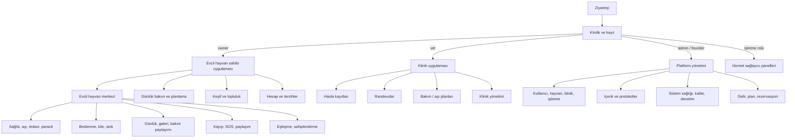
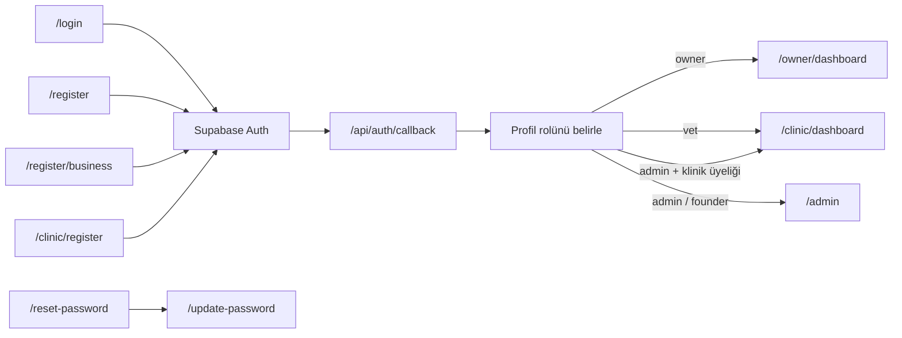
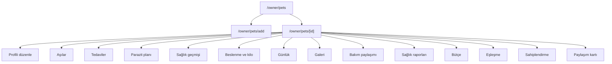
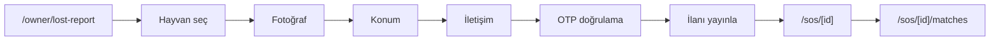
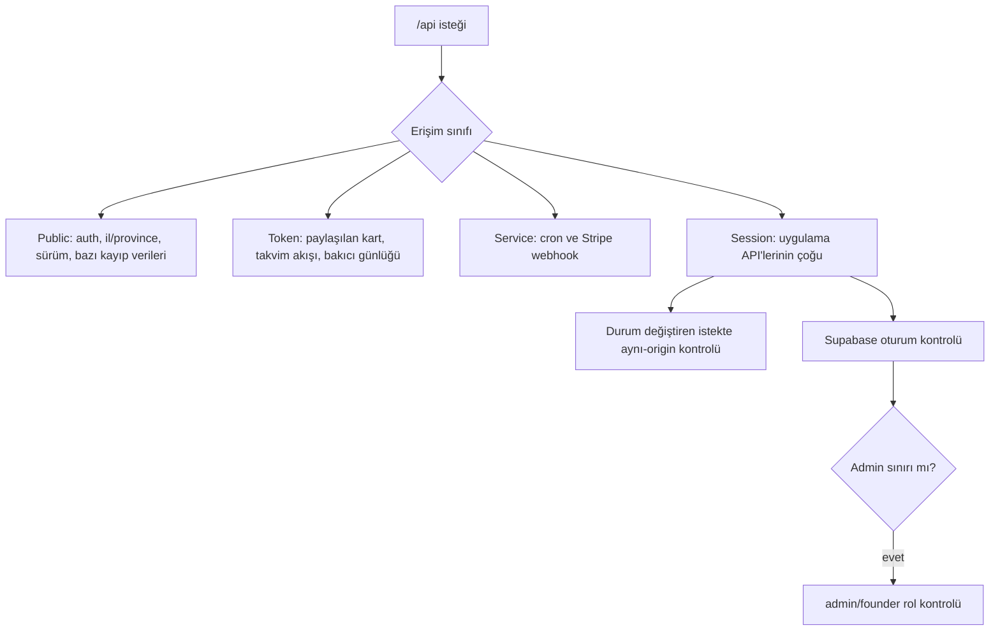
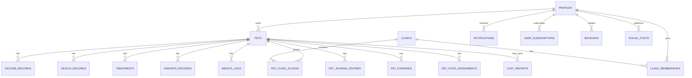
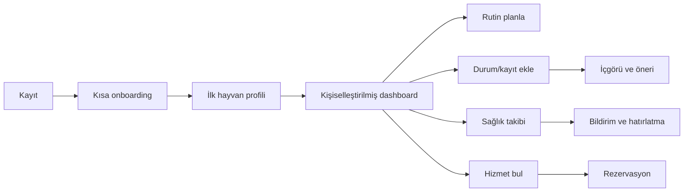

# Odi.Pet Uygulama Haritası

> Kaynak: Mevcut kod tabanı  
> Tarih: 27 Temmuz 2026  
> Kapsam: Ürün yüzeyleri, kullanıcı akışları, sayfalar, API, veri, güvenlik ve işletim katmanları

## 1. Yönetici özeti

Odi.Pet; evcil hayvan sahibi, veteriner/klinik, hizmet sağlayıcı ve platform yöneticisini aynı ekosistemde buluşturan, web ve mobil/PWA uyumlu bir yaşam ve bakım platformudur.

Mevcut kod tabanında:

- **109 sayfa**
- **188 API uç noktası**
- **210 Supabase migration dosyası**
- **3 ana yetkili uygulama alanı:** Sahip, Klinik, Admin
- **4 bağımsız hizmet sağlayıcı paneli:** Kuaför, Bakıcı, Eğitmen, Otel
- **PWA, çevrimdışı ekran, push bildirim ve servis işçisi**
- **Supabase Auth + RLS + rol kontrolü**
- **Stripe abonelik ve ödeme altyapısı**
- **AI Vet, akıllı belge tarama ve öngörüsel risk özellikleri**

bulunmaktadır.

## 2. Üst seviye ürün haritası



## 3. Roller ve erişim modeli

| Rol / yüzey | Giriş rotası | Ana amaç | Koruma |
|---|---|---|---|
| Ziyaretçi | `/login`, `/register` | Giriş ve hesap oluşturma | Herkese açık |
| Evcil hayvan sahibi | `/owner/dashboard` | Evcil hayvan yaşam ve bakım yönetimi | `owner`, `admin`, `founder` |
| Veteriner / klinik personeli | `/clinic/dashboard` | Hasta, randevu ve bakım planı yönetimi | `vet`, `admin`, `founder` |
| Klinik yöneticisi | `/clinic/admin` | Klinik operasyon yönetimi | Klinik üyeliği veya üst rol |
| Platform yöneticisi | `/admin` | Tüm platformu yönetme ve izleme | `admin`, `founder` |
| Kurucu | `/admin` | Tam yönetim erişimi | `founder` |
| Hizmet sağlayıcı | Rol bazlı dashboard | Kuaför, bakıcı, eğitmen, otel operasyonu | İlgili hesap/oturum |
| Davetli bakıcı | `/caregiver/[token]` | Paylaşılan bakım kaydına erişim | Tek kullanımlık/paylaşım tokenı |

Kök rota `/`, kullanıcının rolüne göre doğru panele yönlendirir. Admin rolündeki kullanıcının klinik üyeliği varsa öncelikle klinik paneli açılır.

## 4. Kimlik ve başlangıç akışı



İlk sahip deneyimi, minimum bilgiyle başlayan onboarding ve daha sonra bağlama göre veri isteyen progressive profiling yaklaşımını kullanır.

## 5. Evcil hayvan sahibi uygulaması

### 5.1 Ana navigasyon

Sahip uygulamasının masaüstü yan menüsü ve mobil alt menüsü ortak bir dinamik kaynaktan beslenir:

- `navigation_items.slot = bottom_nav`
- `navigation_items.slot = action_menu`
- `navigation_items.slot = menu_drawer`

Veritabanı kaydı bulunmazsa kod içindeki güvenli varsayılan menü kullanılır.

Ana ürün alanları:

| Alan | Rota | İşlev |
|---|---|---|
| Ana sayfa | `/owner/dashboard` | Hayvan özeti, yaklaşan işler, öneriler, hızlı günlük |
| Evcil hayvanlar | `/owner/pets` | Hayvan listesi ve profil merkezi |
| AI Vet | `/owner/ai-vet` | Yapay zekâ destekli sağlık ön değerlendirmesi |
| Hizmetler | `/owner/services` | Veteriner ve diğer bakım hizmetleri |
| Sosyal | `/owner/social` | Gönderiler, eşleşme ve topluluk |
| İçerikler | `/owner/learn` | Kişiselleştirilmiş öğrenme içerikleri |
| Mesajlar | `/owner/messages` | Görüşmeler ve mesajlaşma |
| Bütçe | `/owner/budget` | Evcil hayvan harcamaları |
| Etkinlikler | `/owner/events` | Etkinlik keşfi ve katılım |
| Mağaza | `/owner/marketplace` | Ürün/hizmet keşfi ve bekleme listesi |
| Veteriner bul | `/owner/vets` | Konum bazlı veteriner arama |
| Bildirimler | `/owner/notifications` | Uyarılar ve hatırlatmalar |
| Profil | `/owner/profile` | Hesap, tercih ve abonelik yönetimi |

### 5.2 Hızlı ekleme akışı

Merkezdeki “Hızlı Ekle” aksiyonu şu işleri az tıklamayla başlatır:

- Rutin planla → `/owner/plan-yap`
- Geçmiş kayıt ekle → `/owner/plan-yap?mode=log`
- Sağlık kaydı / aşı → hayvan seçimi
- Akıllı tarama → `/owner/scanner`
- Durum / günlük kaydet → hayvan seçimi ve günlük oluşturma

### 5.3 Evcil hayvan merkezi



#### Sağlık

- Aşı protokolleri, aşı kayıtları ve kullanıcı tercihleri
- Tedaviler ve ilaçlar
- Parazit ürünleri, uygulama kayıtları ve tamamlanma planı
- Alerjiler ve sağlık geçmişi
- Büyüme, ölçüm ve kilo takibi
- Kızgınlık döngüsü, gözlem, üreme testi ve tahmin
- Irka göre sağlık içeriği
- PDF/çıktı alınabilen sağlık raporları
- AI Vet ve öngörüsel risk değerlendirmesi

#### Beslenme

- Beslenme profili
- Mama kataloğu ve barkod/GTIN arama
- Aktif mama atama, değiştirme ve sonlandırma
- Mama stok takibi
- Öğün kayıtları
- Kilo kayıtları ve hedef bant
- Beslenme analizi

#### Yaşam kaydı ve paylaşım

- Kategorili günlük
- Fotoğraf galerisi
- Bakıcı daveti ve token ile bakım günlüğü
- QR/paylaşım kartı
- SOS kişileri

#### Sosyal yaşam

- Eşleşme profili ve uygunluk
- Çiftleştirme ilanı ve başvuru
- Sağlık özeti paylaşım izni
- Sahiplendirme profili ve başvurular

### 5.4 Kayıp hayvan ve SOS



Akış taslak, fotoğraf, konum ve yayınlama uçlarını ayrı ayrı kullanır. Harita Leaflet ile, bildirim ve yakın eşleşme süreçleri ayrı servislerle çalışır.

### 5.5 Profil ve tercihler

| Rota | İşlev |
|---|---|
| `/owner/profile/edit` | Kişisel bilgiler |
| `/owner/profile/subscription` | Plan, ödeme ve müşteri portalı |
| `/owner/profile/appearance` | Görünüm tercihleri |
| `/owner/profile/unit-preferences` | Ölçü birimleri |
| `/owner/profile/task-settings` | Görev ve plan tercihleri |
| `/owner/profile/vaccine-settings` | Aşı tercihleri |
| `/owner/profile/symptom-settings` | Belirti tercihleri |
| `/owner/profile/product-settings` | Ürün tercihleri |
| `/owner/profile/feeding-templates` | Besleme şablonları |

## 6. Klinik uygulaması

Klinik paneli masaüstü yan menü ve mobil alt menü sunar.

| Alan | Rota | İşlev |
|---|---|---|
| İşlem paneli | `/clinic/dashboard` | Klinik özeti ve günlük operasyon |
| Randevular | `/clinic/appointments` | Randevu yönetimi |
| Hasta kayıtları | `/clinic/pets` | Kliniğe erişimi olan hayvanlar |
| Hasta detayı | `/clinic/pets/[id]` | Klinik sağlık görünümü |
| Bakım/aşı planları | `/clinic/care-plans` | Hasta planları |
| Bildirimler | `/clinic/notifications` | Klinik uyarıları |
| Klinik yönetimi | `/clinic/admin` | Yöneticiye özel ayarlar |

Klinik erişimi `clinic_memberships` ve `pet_clinic_access` ilişkileri üzerinden ayrıştırılır. Platform admini ve founder klinik yüzeyine de erişebilir.

## 7. Hizmet sağlayıcı yüzeyleri

Mevcut bağımsız paneller:

- `/groomer/dashboard` — kuaför
- `/sitter/dashboard` — bakıcı
- `/trainer/dashboard` — eğitmen
- `/hotel/dashboard` — evcil hayvan oteli
- `/register/business` — işletme kaydı

Rezervasyon altyapısı `/api/bookings` ve `/api/business/[businessId]/availability` üzerinden desteklenir.

## 8. Platform yönetim paneli

### 8.1 Ana yönetim alanları

| Grup | Sayfalar |
|---|---|
| Genel bakış | Panel, metrikler, haftalık raporlar |
| Kullanıcı ve varlık | Kullanıcılar, evcil hayvanlar, klinikler, işletmeler |
| Sağlık içeriği | Aşı protokolleri, parazit ürünleri, sağlık yönetimi |
| İçerik | Makaleler, kaynaklar, revizyonlar, medya, üretim işleri, inceleme kuyruğu |
| Ticari | Gelir, abonelik planları, rezervasyonlar |
| Operasyon | Sistem sağlığı, audit logları, limitler, outreach |
| Veri kalitesi | Genel görünüm, kullanıcı analizi, funnel, heatmap |
| Yapay zekâ | AI Vet analizi, intelligence |
| Deneyim yönetimi | Navigasyon, onboarding, ayarlar |

### 8.2 Önemli admin rotaları

- `/admin/users`, `/admin/users/[id]`
- `/admin/pets`
- `/admin/clinics`
- `/admin/businesses`
- `/admin/content`
- `/admin/vaccines`
- `/admin/parasite-products`
- `/admin/ai-vet`
- `/admin/bookings`
- `/admin/revenue`
- `/admin/plans`
- `/admin/system-health`
- `/admin/audit-logs`
- `/admin/data-quality/*`
- `/admin/navigation`
- `/admin/onboarding`
- `/admin/settings`

Not: Admin yan menüsü bugün tüm mevcut admin sayfalarını göstermiyor. Bazı gelişmiş sayfalara doğrudan rota veya başka ekranlardan erişiliyor.

## 9. API haritası

188 API uç noktası iş alanına göre aşağıdaki şekilde dağılır:

| API alanı | Uç sayısı | Kapsam |
|---|---:|---|
| `pets` | 45 | Profil, sağlık, aşı, parazit, beslenme, üreme, paylaşım |
| `admin` | 40 | Yönetim CRUD, içerik, klinik, protokol, navigasyon |
| `cron` | 11 | Plan, bildirim, kalite, rapor ve olay işleme |
| `auth` | 6 | Giriş, kayıt, callback, şifre |
| `social` | 5 | Gönderi, beğeni, yorum, ilan |
| `nutrition` | 4 | Katalog, kayıt ve analiz |
| `v1/reports/lost` | 4 | Kayıp ilanı adımları |
| Diğer alanlar | 73 | Ödeme, rezervasyon, AI, paylaşım, takvim, içerik vb. |

### API erişim sınıfları



## 10. Veri haritası

Migration geçmişi geniştir; aşağıdaki harita canlı şemada kesin olarak var olan her tabloyu değil, kod tabanındaki güncel veri alanlarını ve migration tanımlarını iş alanlarına göre özetler.



### 10.1 Kimlik ve organizasyon

- `profiles`, `pets`, `pet_owners`, `pet_members`
- `clinics`, `clinic_memberships`, `pet_clinic_access`
- `business_profiles`, `business_availability`
- `pet_invites`, `shared_pet_cards`

### 10.2 Sağlık ve bakım

- `vaccine_records`, `vaccine_templates`, `vaccine_protocols`
- `pet_vaccine_preferences`, `vaccination_plan_items`
- `health_records`, `health_measurements`, `health_treatments`
- `health_medications`, `health_allergies`, `health_growth`
- `parasite_products`, `parasite_protocols`, `parasite_records`
- `care_plans`, `pet_care_tasks`, `pet_care_events`
- `weight_logs`, `growth_records`, `pet_expenses`

### 10.3 Beslenme

- `food_brands`, `food_skus`, `food_label_versions`
- `pet_nutrition_profiles`, `pet_food_assignments`
- `pet_food_inventory`, `feeding_logs`, `nutrition_logs`

### 10.4 Üreme, sosyal ve sahiplendirme

- `pet_estrus_cycles`, `pet_estrus_observations`
- `pet_reproductive_tests`, `pet_estrus_preferences`
- `breeding_listings`, `breeding_applications`
- `breeding_consent_records`, `pet_breeding_eligibility`
- `social_posts`, `post_likes`, `post_comments`
- `pet_matches`, `pet_adoptions`

### 10.5 Güvenlik, kayıp ve bildirim

- `lost_report_drafts`, `lost_reports`, `lost_report_contacts`
- `notifications`, `notification_jobs`, `push_subscriptions`
- `devices`, `security_audit_logs`, `session_logs`

### 10.6 İçerik, AI ve analitik

- `articles`, `article_sources`, `article_revisions`, `article_media`
- `content_generation_jobs`, `monitored_sources`
- `predictive_insights`, `ai_usage_logs`
- `funnel_events`, `activation_metrics`, `step_events`
- `user_survey_stats`, `profiling_prompts`

### 10.7 Ticari

- `subscription_plans`, `user_subscriptions`, `payments`
- `stripe_webhook_events`
- `bookings`, `marketplace_products`, `marketplace_clicks`
- `referrals`, `referral_rewards`

## 11. Otomasyon ve arka plan işleri

| İş | API |
|---|---|
| Bildirim dağıtımı | `/api/cron/dispatch-notifications` |
| Aşı kontrolü | `/api/cron/vaccine-check` |
| Haftalık rapor | `/api/cron/weekly-report` |
| Abonelik hatırlatmaları | `/api/cron/subscription-reminders` |
| Plan çalıştırma | `/api/cron/plans` |
| Olay akışı işleme | `/api/cron/process-events` |
| Kart süresi sonlandırma | `/api/cron/expire-cards` |
| Veri kalitesi | `/api/cron/data-quality` |
| Kullanıcı sağlığı | `/api/cron/user-health` |
| Anomali tespiti | `/api/cron/anomaly-detector` |
| Orkestrasyon | `/api/cron/orchestrator` |

Supabase Edge Functions tarafında bildirim dağıtımı ve AI skor hesaplama fonksiyonları da bulunur.

## 12. Dış servisler ve altyapı

| Katman | Teknoloji / servis |
|---|---|
| Web uygulaması | Next.js 16 App Router, React 19 |
| Stil | Tailwind CSS 4 |
| Kimlik ve veri | Supabase Auth, Postgres, RLS, RPC |
| Form ve doğrulama | React Hook Form, Zod |
| PWA | Serwist, service worker, offline rota |
| Harita | Leaflet |
| Ödeme | Stripe Checkout, Portal, Webhook |
| AI | Google Gemini istemcileri |
| Bildirim | Web Push + Supabase jobs |
| Hız sınırlama | Upstash Redis / Ratelimit |
| Test | Vitest, Playwright, Supabase DB testleri |

## 13. Kaynak kod dizin haritası

```text
src/
├── app/                 Sayfalar, layout'lar ve 188 API route
│   ├── owner/           Sahip uygulaması
│   ├── clinic/          Klinik uygulaması
│   ├── admin/           Platform yönetimi
│   └── api/             Sunucu uç noktaları
├── components/          Ortak ve modül bazlı arayüz bileşenleri
├── features/            Auth, klinik ve pet server action'ları
├── lib/                 İş kuralları ve altyapı servisleri
├── services/            Üreme/kızgınlık gibi domain servisleri
├── store/               Zustand istemci durumu
├── types/               Ortak TypeScript tipleri
├── proxy.ts             Oturum, rol, CSRF ve rota sınırı
└── sw.ts                PWA service worker

supabase/
├── migrations/          Şema, RLS, RPC ve veri dönüşümleri
├── functions/           Edge Functions
└── tests/database/      Veritabanı güvenlik ve davranış testleri

e2e/                     Uçtan uca ürün senaryoları
tests/                   UX ve entegrasyon senaryoları
public/                  PWA, ikon, harita ve statik varlıklar
```

## 14. Test kapsamı haritası

Mevcut E2E senaryoları şu kritik akışları kapsar:

- Auth ve onboarding
- Ana sahip akışı
- Dashboard
- Evcil hayvan profili
- Sağlık ve bakım
- Aşılar
- Büyüme ve beslenme
- Kayıp hayvan yaşam döngüsü, doğrulama, duplicate ve RLS
- Abonelik ve ödeme
- Klinik/admin paneli
- PWA
- Mobil giriş ve mobil UX
- GPS izni reddedilen veteriner rehberi
- Cron güvenliği
- Akıllı tarayıcı

Unit ve veritabanı testleri; iş algoritmaları, RLS, service-role yetkileri, webhook idempotency, beslenme atama/sonlandırma ve sağlık kayıtlarını destekler.

## 15. Gözlemler ve mimari notlar

### Güçlü taraflar

- Roller ve uygulama yüzeyleri belirgin biçimde ayrılmış.
- Sahip navigasyonu uzaktan/dinamik yönetilebilir.
- Kritik veri erişimleri Supabase RLS ile destekleniyor.
- Sağlık ve kayıp hayvan gibi riskli alanlarda özel testler var.
- Mobil/PWA bir eklenti değil, temel mimarinin parçası.
- Progressive profiling için ayrı bileşen ve veri yapıları mevcut.
- Cron, webhook ve token erişimleri normal kullanıcı oturumundan ayrıştırılmış.

### Dikkat edilmesi gerekenler

- Migration sayısı ve şema geçmişi çok geniş; canlı şema için Supabase üzerinden ayrıca “gerçek durum envanteri” alınmalıdır.
- Admin yan menüsü, mevcut 27 admin sayfasının yalnızca bir kısmını gösteriyor.
- `owner`, `clinic` ve `admin` dışındaki hizmet sağlayıcı panelleri ürünün geri kalanına göre daha ince bir yüzey oluşturuyor.
- Kod çıktısında bazı Türkçe metinlerde karakter kodlama bozulması işaretleri görülüyor; dosya kodlamaları ayrıca denetlenmeli.
- Kök README hâlâ genel Next.js başlangıç metni; bu belge README’den erişilebilir hale getirilmelidir.
- Eski/alternatif sağlık tabloları (`health_*`, `vaccine_records`, `vaccine_records_v2` gibi) migration geçmişinde birlikte görünüyor. Aktif yazma kaynağı ve kanonik model düzenli olarak belgelenmelidir.

## 16. Kısa ürün yolculuğu



Bu akış, Odi.Pet'in temel değer önerisini özetler: **az veriyle başla, günlük bakımı kolaylaştır, gerektiği anda bağlamsal bilgi iste ve sağlık risklerini erken görünür kıl.**
