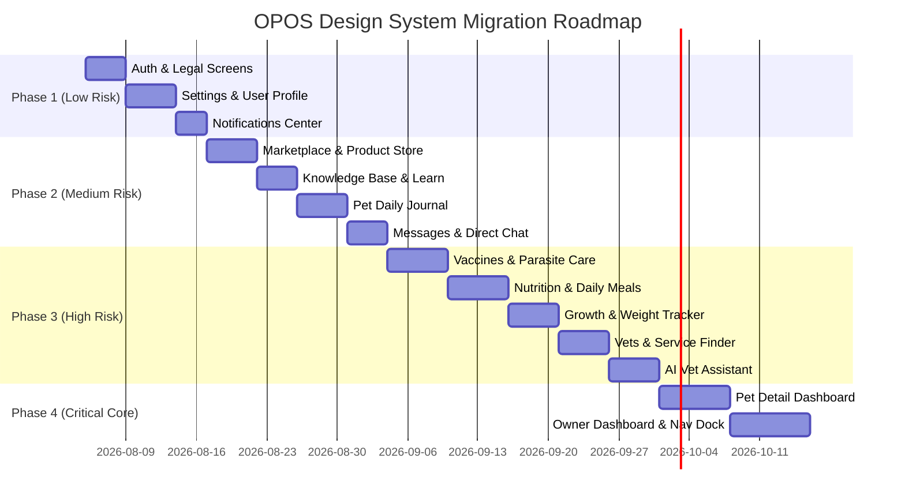

# Odi.Pet OPOS Migration Roadmap & Risk-Ordered Plan

> **Status:** AUDITED / READ-ONLY MIGRATION ROADMAP  
> **Migration Sequencing:** Lowest Risk $\rightarrow$ Highest Risk  
> **Sprint Horizon:** Sprints 2 through 6  

---

## 1. Risk-Ordered Migration Matrix

---

## 2. Detailed Screen Sequencing & Impact Analysis

| Sequence | Screen Domain | Est. Components | Key Dependencies | Business Impact | Visual Impact | Risk Level | Complexity | Est. Hours | Target Sprint |
| :---: | :--- | :---: | :--- | :---: | :---: | :---: | :---: | :---: | :---: |
| **1** | **Auth & Legal** | 8 | Auth Provider, Supabase Auth | Low | Medium | **Low** | Low | 12h | Sprint 2 |
| **2** | **Settings & Profile** | 12 | User Store, Local Preferences | Low | Medium | **Low** | Low | 16h | Sprint 2 |
| **3** | **Notifications Center** | 6 | Push Notification Service | Low | Medium | **Low** | Low | 10h | Sprint 2 |
| **4** | **Marketplace Store** | 14 | Commerce API, Cart Store | Medium | High | **Med-Low** | Medium | 20h | Sprint 3 |
| **5** | **Knowledge Base & Learn** | 8 | CMS Content Provider | Low | Medium | **Med-Low** | Low | 14h | Sprint 3 |
| **6** | **Pet Daily Journal** | 16 | Storage API, Media Uploader | Medium | High | **Medium** | Medium | 22h | Sprint 3 |
| **7** | **Messages & Chat** | 10 | Realtime Supabase Channels | Medium | Medium | **Medium** | Medium | 18h | Sprint 3 |
| **8** | **Vaccines & Parasite** | 18 | Medical Audit Engine, Booster Alerts | High | High | **Med-High** | High | 28h | Sprint 4 |
| **9** | **Nutrition & Meals** | 15 | Calorie Calculator Engine | High | High | **Med-High** | High | 26h | Sprint 4 |
| **10** | **Growth & Weight** | 12 | Chart.js / Recharts Engine | High | Medium | **Med-High** | High | 24h | Sprint 4 |
| **11** | **Vets & Booking** | 14 | Geolocation, Booking API | High | High | **Med-High** | High | 24h | Sprint 4 |
| **12** | **AI Vet Assistant** | 10 | Streaming LLM Service, Medical Disclaimer | High | High | **High** | High | 26h | Sprint 5 |
| **13** | **Social & Community** | 16 | Feed Service, Like/Comment Store | Medium | High | **High** | High | 28h | Sprint 5 |
| **14** | **Pet Detail Dashboard** | 24 | Pet State Context, Medical Summary | Critical | Critical | **Critical** | Critical | 36h | Sprint 5 |
| **15** | **Owner Dashboard & Nav** | 30 | Global Navigation, Active Pet Context | Critical | Critical | **Critical** | Critical | 40h | Sprint 6 |

---

## 3. Risk Mitigation Rules During Implementation

1. **Gated Progression**: Phase 1 screens MUST be 100% accepted by user approval and automated regression tests before Phase 2 begins.
2. **Locked Hero & Cover Components**: As specified in system rules, `PetHeroCard.tsx` and core hero cover structures in `PetDetailClient.tsx` remain locked under explicit review protocol.
3. **Isolated Component Commits**: Every component migration must be committed independently with visual snapshot comparison.
4. **No Logic Mutation**: UI migration PRs must contain **zero** modifications to Supabase queries, data fetching hooks, or state reducers.
