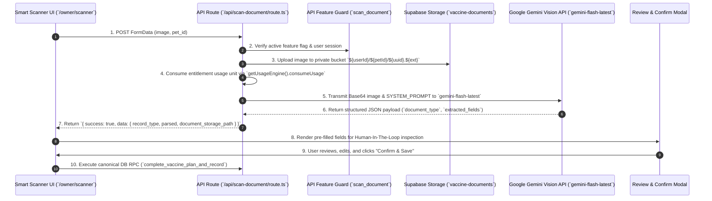

# AI & SMART SCANNER ARCHITECTURE FORENSIC SPECIFICATION

**System:** Odi Pet Platform  
**Scope:** Complete Audit of Gemini Vision OCR, Document Scanning Flow, Prompt Structures, Data Extraction Normalization, OPOS Vol 13 Human-In-The-Loop Verification, Fallback Mechanics, and Medical Disclaimer Enforcement  
**Audit Date:** August 12, 2026  
**Status:** FORENSIC BASELINE SPECIFICATION (READ-ONLY AUDIT)  

---

## 1. END-TO-END SMART SCANNER ARCHITECTURE FLOW



---

## 2. DETAILED AI SYSTEM SPECIFICATIONS

### 2.1 Gemini Vision OCR & System Prompt Structure
- **ENDPOINT ROUTE:** [`/api/scan-document/route.ts`](file:///c:/Odi.Pet/src/app/api/scan-document/route.ts).
- **MODEL TARGET:** `https://generativelanguage.googleapis.com/v1beta/models/gemini-flash-latest:generateContent?key=${apiKey}`.
- **GENERATION CONFIG:** `temperature: 0.1`, `responseMimeType: "application/json"`.
- **SYSTEM PROMPT SPECIFICATION:**
  ```text
  Sen bir evcil hayvan bakım uygulaması için akıllı belge tarama asistanısın.
  Gönderilen fotoğrafı analiz et ve aşağıdaki JSON formatında, eksiksiz ve yapılandırılmış olarak yanıt ver.
  Markdown kullanma, sadece saf JSON döndür.

  Zorunlu JSON Şeması:
  {
    "document_type": "pet_passport" | "official_document" | "food_packaging" | "vaccine_card" | "medicine_packaging" | "parasite_product" | "unknown",
    "confidence": 0.0 - 1.0,
    "extracted_fields": {
      "microchip_no": "15 haneli mikroçip numarası",
      "passport_no": "Pasaport / karne numarası",
      "registration_city": "Kayıtlı olunan il",
      "registration_district": "Kayıtlı olunan ilçe",
      "agriculture_directorate": "İlçe Tarım ve Orman Müdürlüğü adı",
      "title": "Aşı/İlaç/Ürün Adı",
      "brand": "Marka",
      "lot_number": "Lot Numarası",
      "product_expiry_at": "YYYY-MM-DD",
      "administration_route": "parenteral_sc | parenteral_im | intranasal | oral",
      "date": "YYYY-MM-DD",
      "next_date": "YYYY-MM-DD",
      "vet_name": "Veteriner Hekim Adı",
      "vet_company": "Klinik Adı"
    }
  }
  ```
- **EVIDENCE RATING:** `CONFIRMED` — Code source: [`src/app/api/scan-document/route.ts:L9-L66`](file:///c:/Odi.Pet/src/app/api/scan-document/route.ts#L9-L66).

---

### 2.2 Extraction Normalization & Supported Document Types
The OCR scanner automatically normalizes raw text output into 7 distinct document categories:
1. `pet_passport`: Extracts 15-digit microchip number, passport registration number, city/district, and directorate details.
2. `vaccine_card`: Extracts vaccine title, brand (e.g. Nobivac, Defensor), lot/batch number, administration date, and next due date.
3. `parasite_product`: Extracts product name, parasite type (internal/external), application method (spot-on, oral tablet, collar), active ingredients, and protection duration in days.
4. `food_packaging`: Extracts food brand, product line, food type (dry/wet), package size in grams, target species, and target age group.
5. `medicine_packaging`: Extracts medication title, dosage (e.g. 250mg), and usage duration.
6. `official_document`: Extracts clinic details, vet name, and registration numbers.
7. `unknown`: Fallback classification when document cannot be recognized with high confidence.

- **EVIDENCE RATING:** `CONFIRMED` — Code source: [`src/app/api/scan-document/route.ts:L16-L64`](file:///c:/Odi.Pet/src/app/api/scan-document/route.ts#L16-L64).

---

### 2.3 OPOS Vol 13 Human-In-The-Loop Verification Architecture
- **GOVERNANCE RULE:** In strict compliance with **OPOS Volume 13 (AI Governance & Human-in-the-Loop)**, AI tools CANNOT autonomously insert, update, or delete records in canonical database tables.
- **IMPLEMENTATION:**
  - The API route `/api/scan-document` ONLY uploads the image to private storage and returns the extracted JSON object to the client browser.
  - The client application renders a pre-filled **Review & Confirm UI Modal**.
  - The user must explicitly inspect the extracted fields (microchip, dates, titles, lot numbers), edit any misreads, and click **"Onayla ve Kaydet"** (Confirm & Save).
  - Only upon this explicit user action does the client invoke the canonical RPC (`complete_vaccine_plan_and_record`).
- **EVIDENCE RATING:** `CONFIRMED` — Code source: [`src/app/api/scan-document/route.ts:L233-L240`](file:///c:/Odi.Pet/src/app/api/scan-document/route.ts#L233-L240), [`AGENTS.md`](file:///c:/Odi.Pet/AGENTS.md).

---

### 2.4 Quota Consumption, Security & Private Storage
1. **Rate Limiting:** `scanDocRateLimit.limit(`${user.id}:${ip}`)` prevents API abuse ([`src/app/api/scan-document/route.ts:L92`](file:///c:/Odi.Pet/src/app/api/scan-document/route.ts#L92)).
2. **File Size & Type Constraints:** Enforces max file size of 10MB (`10 * 1024 * 1024` bytes) and allowed MIME types: `image/jpeg`, `image/png`, `image/webp`, `application/pdf`.
3. **Private Storage:** Document files are stored in Supabase private bucket `vaccine-documents` under path `${user.id}/${petId}/${uuid}.${ext}` ([`20260710000001_vaccine_documents_bucket.sql`](file:///c:/Odi.Pet/supabase/migrations/20260710000001_vaccine_documents_bucket.sql)). Access requires signed URLs (`createSignedUrl`).
4. **Quota Consumption:** Quota engine `getUsageEngine().consumeUsage()` checks entitlement BEFORE making the expensive Gemini Vision API call. If quota is exceeded, the uploaded temp file is deleted via `cleanupUpload()` and a `403 Forbidden` response is returned.
- **EVIDENCE RATING:** `CONFIRMED` — Code source: [`src/app/api/scan-document/route.ts:L166-L182`](file:///c:/Odi.Pet/src/app/api/scan-document/route.ts#L166-L182).

---

### 2.5 Fallback Mechanics & Mock Response Behavior
- If `GEMINI_API_KEY` is omitted in the environment variables, the system logs a warning (`GEMINI_API_KEY is not set. Using mock response.`), waits 300ms, and returns a safe mock response payload:
  ```json
  {
    "success": true,
    "data": {
      "record_type": "vaccine_card",
      "parsed": {
        "title": "Karma Aşı",
        "brand": "Nobivac",
        "date": "2026-08-12",
        "next_date": null
      },
      "document_storage_path": "user_id/pet_id/mock.jpg"
    }
  }
  ```
- **EVIDENCE RATING:** `CONFIRMED` — Code source: [`src/app/api/scan-document/route.ts:L142-L159`](file:///c:/Odi.Pet/src/app/api/scan-document/route.ts#L142-L159).

---

### 2.6 Medical Disclaimer & Visual Indicator Enforcement
1. **AI Visual Indicator:** All AI-derived outputs (OCR suggestions, AI Vet chat advice, article summaries) render the **Mor Yıldız / Sparkles Icon (`Sparkles`)** with violet accent styling (`text-purple-600`, `bg-purple-50`).
2. **Medical Disclaimer:** All AI outputs display the mandatory legal disclaimer:
   > *"Bu bir klinik teşhis değildir. Acil durumlarda ve şüpheli durumlarda mutlaka lisanslı bir veteriner hekime danışınız."*
- **EVIDENCE RATING:** `CONFIRMED` — Code source: [`src/lib/agents/userHealthAgent.ts`](file:///c:/Odi.Pet/src/lib/agents/userHealthAgent.ts), [`AGENTS.md`](file:///c:/Odi.Pet/AGENTS.md).
