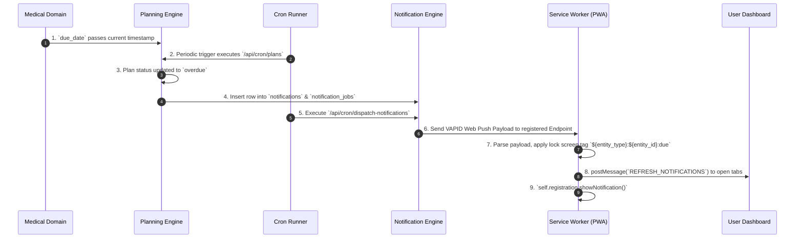

# DOMAIN DEPENDENCY GRAPH & INTER-DOMAIN EVENT CASCADE MAP

**System:** Odi Pet Platform  
**Scope:** Full Inter-Domain Dependency Graph, Event Cascade Architecture, and Cascading Flow Directions  
**Audit Date:** August 12, 2026  
**Status:** FORENSIC BASELINE SPECIFICATION (READ-ONLY AUDIT)  

---

## 1. COMPREHENSIVE MERMAID INTER-DOMAIN DEPENDENCY GRAPH

```mermaid
graph TD
    %% Primary Identity & Core Anchor Domains
    IAM["1. User Identity & IAM Context<br/>(profiles, devices, security_audit_logs)"] 
    PetCore["2. Pet Core & Family Membership<br/>(pets, pet_memberships, pet_owners)"]

    %% Core Dependencies
    IAM -->|auth.uid() FK & RLS Guard| PetCore

    %% Clinical & Medical Domains
    Medical["3. Medical & Preventive Health<br/>(vaccines, parasites, health_records)"]
    Estrus["4. Reproductive & Breeding<br/>(pet_estrus_cycles, breeding_listings)"]
    Nutrition["5. Nutrition & Food Assignment<br/>(pet_food_assignments, nutrition_logs)"]
    CareWeight["6. Care & Weight Management<br/>(care_plans, weight_logs)"]
    Planning["7. Planning & Agenda Engine<br/>(plans, notification_jobs)"]

    PetCore -->|pet_id FK & ownership validation| Medical
    PetCore -->|pet_id FK & gender/neuter status check| Estrus
    PetCore -->|pet_id FK & species/weight profile| Nutrition
    PetCore -->|pet_id FK & target baseline| CareWeight
    
    Medical -->|schedule items & overdue triggers| Planning
    Nutrition -->|feeding reminders & swap milestones| Planning
    CareWeight -->|routine hygiene & weight tasks| Planning

    %% System Engine & Messaging Domains
    Notifications["8. Notifications & Cron Engine<br/>(notifications, device_push_subscriptions)"]
    SOS["9. Emergency SOS & Lost Reports<br/>(lost_reports, lost_report_contacts)"]
    SocialMarket["10. Social & Marketplace Vets<br/>(social_posts, clinics, bookings, payments)"]
    AIIntelligence["11. AI & Smart Scanner<br/>(smart_scanner_records, articles, ai-vet)"]
    Orchestration["12. Experience & Monthly Orchestrator<br/>(orchestrator_campaigns, analytics)"]
    AdminRegistry["13. Admin & Feature Registry<br/>(feature_registry, feature_usages, settings)"]

    Planning -->|enqueue_notification_job()| Notifications
    Estrus -->|createEstrusNotifications()| Notifications
    Medical -->|createVaccineNotifications()| Notifications

    PetCore -->|pet_id FK & public poster generation| SOS
    IAM -->|contact profile lookup| SOS
    SOS -->|geo-located emergency broadcast| Notifications

    IAM -->|profile_id FK| SocialMarket
    PetCore -->|pet_id FK & clinic authorization| SocialMarket
    SocialMarket -->|booking & payment status alerts| Notifications

    PetCore -->|pet_id OCR assignment| AIIntelligence
    Medical -->|document scan source link| AIIntelligence
    IAM -->|quota consumption via getUsageEngine| AIIntelligence

    IAM -->|user segment matching| Orchestration
    PetCore -->|growth gallery photo count audit| Orchestration

    AdminRegistry -->|withAPIFeatureGuard & entitlement check| IAM
    AdminRegistry -->|feature key check| AIIntelligence
    AdminRegistry -->|feature key check| Medical
    AdminRegistry -->|feature key check| SocialMarket

    classDef primary fill:#4f46e5,stroke:#312e81,color:#fff,stroke-width:2px;
    classDef clinical fill:#0284c7,stroke:#075985,color:#fff,stroke-width:2px;
    classDef engine fill:#d97706,stroke:#78350f,color:#fff,stroke-width:2px;
    classDef admin fill:#059669,stroke:#064e3b,color:#fff,stroke-width:2px;

    class IAM,PetCore primary;
    class Medical,Estrus,Nutrition,CareWeight clinical;
    class Planning,Notifications,SOS,SocialMarket,AIIntelligence,Orchestration engine;
    class AdminRegistry admin;
```

---

## 2. INTER-DOMAIN REFERENCE & CASCADING EVENT MATRIX

| Source Domain | Target Domain | Trigger Mechanism / Flow Direction | Database / Code Signature | Cascading Side Effects | Evidence Rating |
| :--- | :--- | :--- | :--- | :--- | :--- |
| **IAM** | **Pet Core** | User creation triggers profile seed | [`all_in_one_supabase.sql:L173`](file:///c:/Odi.Pet/all_in_one_supabase.sql#L173) `handle_new_user()` | Profiles populated; default owner role assigned. | `CONFIRMED` |
| **Pet Core** | **Medical Health** | Pet profile creation triggers default protocol match | [`20260705000006_backfill_plan_items.sql`](file:///c:/Odi.Pet/supabase/migrations/20260705000006_backfill_plan_items.sql) | Vaccination and parasite plan items created for pet. | `CONFIRMED` |
| **Medical Health** | **Planning Engine** | Vaccine completion RPC creates next schedule item | [`20260723190001_atomic_rpc_and_idempotency_v6.sql`](file:///c:/Odi.Pet/supabase/migrations/20260723190001_atomic_rpc_and_idempotency_v6.sql) | Historical record saved; `plans` row marked completed; next cycle plan generated. | `CONFIRMED` |
| **Medical Health** | **Notifications** | Overdue vaccine scanner detects overdue dates | [`create-overdue-vaccine-notifications.ts`](file:///c:/Odi.Pet/src/lib/notifications/create-overdue-vaccine-notifications.ts) | `notifications` row inserted; Web Push enqueued in `notification_jobs`. | `CONFIRMED` |
| **Planning Engine** | **Notifications** | Cron task runner checks pending jobs | [`dispatch-notifications/route.ts`](file:///c:/Odi.Pet/src/app/api/cron/dispatch-notifications/route.ts) | Triggers Supabase Edge Function `dispatch-notifications` via VAPID. | `CONFIRMED` |
| **Notifications** | **Client PWA** | Service Worker push event listener | [`sw.ts:L87-L153`](file:///c:/Odi.Pet/src/sw.ts#L87-L153) | Deduplicated push banner displayed; live postMessage sent to active app tabs. | `CONFIRMED` |
| **Nutrition** | **Planning Engine** | 7-day food swap transition RPC execution | [`20260724180000_nutrition_assignment_swap.sql`](file:///c:/Odi.Pet/supabase/migrations/20260724180000_nutrition_assignment_swap.sql) | Previous assignment ended; new assignment activated; daily transition task items scheduled. | `CONFIRMED` |
| **Estrus** | **Medical Health** | Mating eligibility evaluation | [`evaluateBreedingEligibility.ts`](file:///c:/Odi.Pet/src/lib/estrus/evaluateBreedingEligibility.ts) | Checks vaccine & parasite records; outputs health advisory flags. | `CONFIRMED` |
| **Emergency SOS** | **Notifications** | Lost pet report published | [`20260724233000_complete_lost_report_wizard.sql`](file:///c:/Odi.Pet/supabase/migrations/20260724233000_complete_lost_report_wizard.sql) | Public URL generated; emergency notification payload dispatched to nearby owners. | `CONFIRMED` |
| **AI Scanner** | **Admin / Registry** | Document scan POST request | [`scan-document/route.ts:L259`](file:///c:/Odi.Pet/src/app/api/scan-document/route.ts#L259) | `withAPIFeatureGuard('scan_document')` verifies active flag & consumes user quota. | `CONFIRMED` |
| **Orchestrator** | **Pet Core** | Monthly Growth evaluation on app load | [`20260806123000_monthly_growth_orchestrator.sql`](file:///c:/Odi.Pet/supabase/migrations/20260806123000_monthly_growth_orchestrator.sql) | Checks `pet_gallery` for photo within 30 days; displays `SmartMonthlyGrowthPrompt` bottom sheet. | `CONFIRMED` |
| **Admin Panel** | **Feature Registry** | Feature flag version publication RPC | [`20260807020000_publish_rpc.sql`](file:///c:/Odi.Pet/supabase/migrations/20260807020000_publish_rpc.sql) | Increments registry version; snapshots system flags; invalidates client cache. | `CONFIRMED` |

---

## 3. CASCADING EVENT CHAIN SPECIFICATION: VACCINE OVERDUE TO PUSH DELIVERY

To illustrate exact inter-domain cascade mechanics, the table below documents the step-by-step lifecycle of an overdue vaccine event across 6 distinct domain contexts:



### Cascade Execution Log Analysis:
1. **Medical Domain:** Data state in `vaccine_records_v2` or `vaccination_plan_items` reaches target `due_date`.
2. **Planning Engine:** Cron route [`/api/cron/plans`](file:///c:/Odi.Pet/src/app/api/cron/plans/route.ts) scans uncompleted items; marks status as `overdue` in `plans` table ([`20260710000003_plans_status_overdue.sql`](file:///c:/Odi.Pet/supabase/migrations/20260710000003_plans_status_overdue.sql)).
3. **Notification Engine:** Persistent entry created in `notifications` table (`is_read = false`); background job queued in `notification_jobs` ([`20260615154000_create_plans_and_notification_jobs.sql`](file:///c:/Odi.Pet/supabase/migrations/20260615154000_create_plans_and_notification_jobs.sql)).
4. **Cron Processor:** Dispatch cron route [`/api/cron/dispatch-notifications`](file:///c:/Odi.Pet/src/app/api/cron/dispatch-notifications/route.ts) calls Supabase Edge Function `dispatch-notifications` with Bearer auth token.
5. **Web Push Client:** WebPush client library ([`web-push-client.ts`](file:///c:/Odi.Pet/src/lib/notifications/web-push-client.ts)) formats VAPID headers and transmits push message to Google FCM / Apple APNs.
6. **Service Worker (PWA):** Service worker [`sw.ts`](file:///c:/Odi.Pet/src/sw.ts) intercepts `push` event, derives lock screen tag `vaccine:${vaccine_id}:overdue`, sends live tab postMessage update, and renders native OS alert notification.
