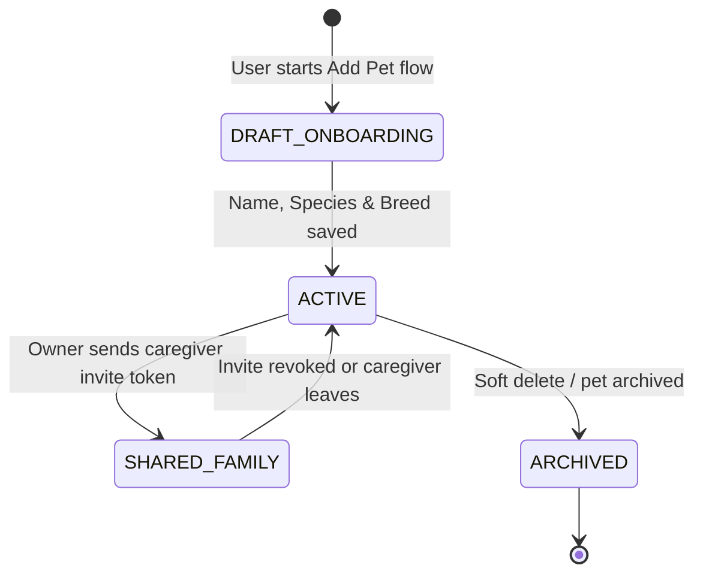
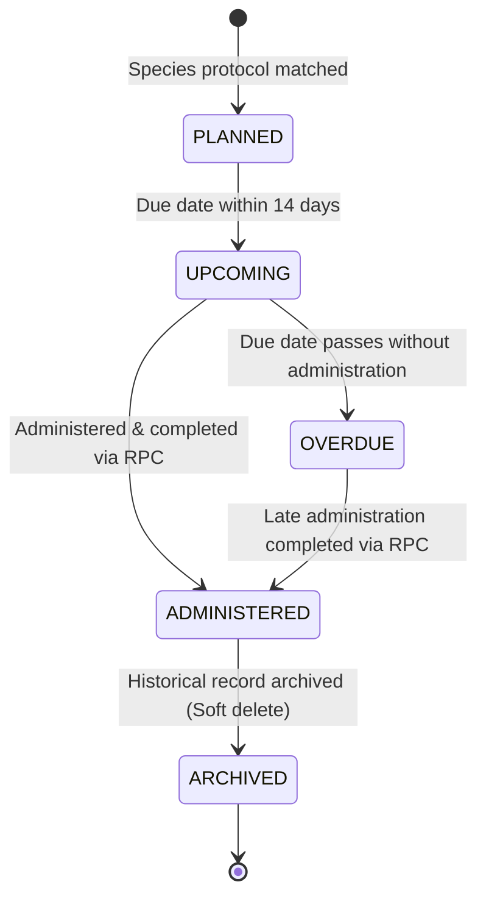
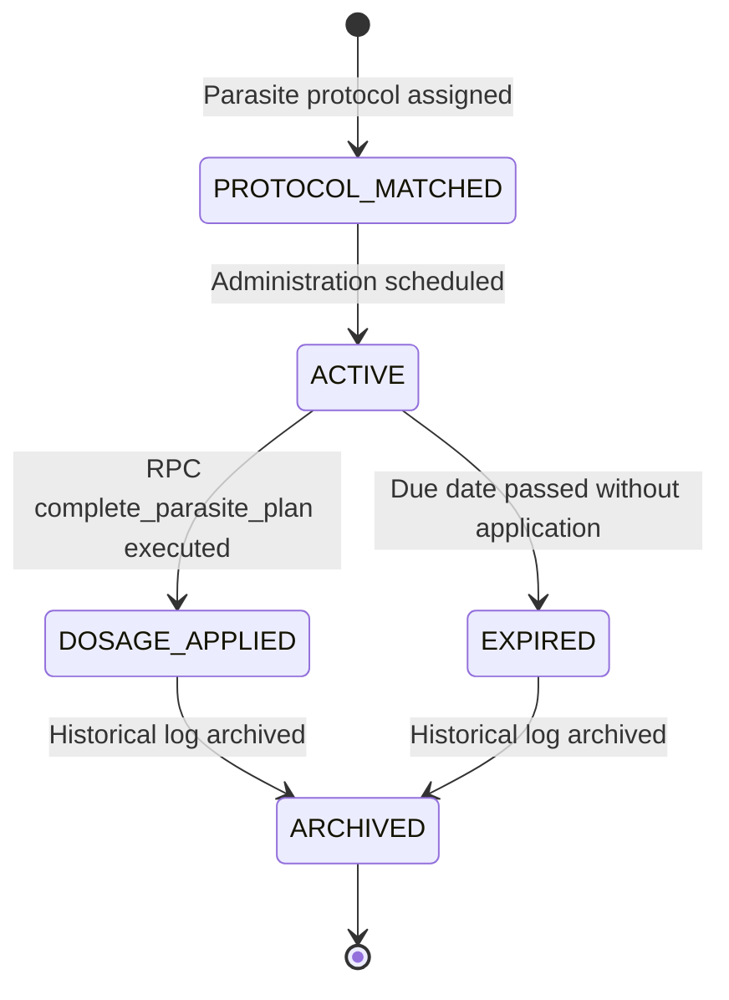
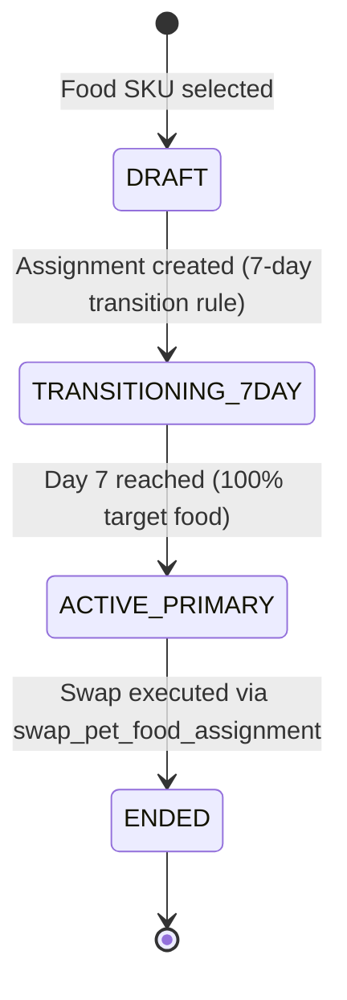
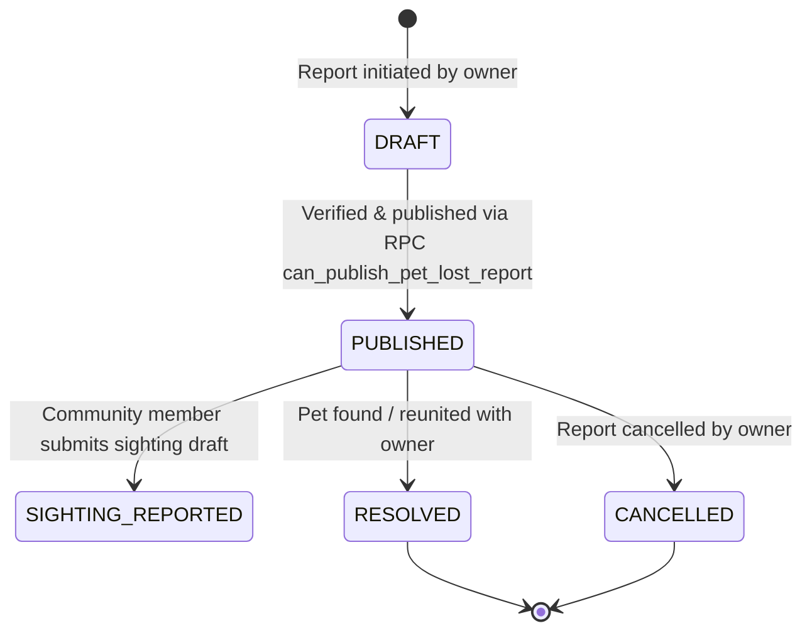
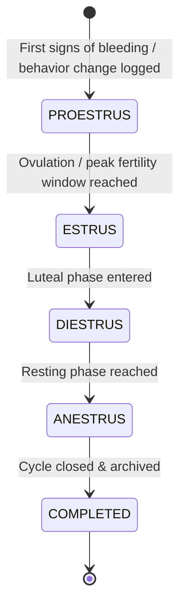

# ENTITY LIFECYCLE & STATE TRANSITION ARCHITECTURE SPECIFICATION

**System:** Odi Pet Platform  
**Scope:** Formal State Lifecycles, Mutation Triggers, RLS Security Rules, and Archival Patterns for Key Business Entities  
**Audit Date:** August 12, 2026  
**Status:** FORENSIC BASELINE SPECIFICATION (READ-ONLY AUDIT)  

---

## 1. ENTITY LIFECYCLE OVERVIEW MATRIX

Every core business entity in Odi Pet follows a strictly defined lifecycle sequence. In accordance with **OPOS Canonical Data & Health Data Protection Standards (Vol 5 & 6)**, medical entities CANNOT be hard-deleted from the database; they transition exclusively into an `archived` or `inactive` state.

| Entity Name | Primary State Field | Full Allowed State Sequence | Soft-Delete / Archival Support | Evidence Rating & Code Location |
| :--- | :--- | :--- | :--- | :--- |
| **Pet Profile** | Derived / Status | `DRAFT_ONBOARDING` -> `ACTIVE` -> `SHARED_FAMILY` -> `ARCHIVED` | Supported (`is_archived` / `deleted_at`) | `CONFIRMED` — [`20260806140000_fix_pet_deletion_cascade.sql`](file:///c:/Odi.Pet/supabase/migrations/20260806140000_fix_pet_deletion_cascade.sql) |
| **Vaccine Record** | Status / Protocol | `PLANNED` -> `UPCOMING` -> `ADMINISTERED` -> `OVERDUE` -> `ARCHIVED` | Mandatory Archival Only (`is_archived = true`) | `CONFIRMED` — [`20260715164000_remove_duplicate_vaccines_and_add_unique.sql`](file:///c:/Odi.Pet/supabase/migrations/20260715164000_remove_duplicate_vaccines_and_add_unique.sql) |
| **Parasite Plan & Product** | Status | `PROTOCOL_MATCHED` -> `ACTIVE` -> `DOSAGE_APPLIED` -> `EXPIRED` -> `ARCHIVED` | Mandatory Archival Only (`is_archived = true`) | `CONFIRMED` — [`20260715210000_create_parasite_protocol_architecture.sql`](file:///c:/Odi.Pet/supabase/migrations/20260715210000_create_parasite_protocol_architecture.sql) |
| **Care Plan** | Status | `DRAFT` -> `ACTIVE` -> `PAUSED` -> `COMPLETED` -> `CANCELLED` | Supported | `CONFIRMED` — [`20260518000000_care_plans.sql`](file:///c:/Odi.Pet/supabase/migrations/20260518000000_care_plans.sql) |
| **Task / Schedule Item** | `status` | `pending` -> `completed` / `overdue` -> `dismissed` | Supported | `CONFIRMED` — [`20260710000003_plans_status_overdue.sql`](file:///c:/Odi.Pet/supabase/migrations/20260710000003_plans_status_overdue.sql) |
| **Pet Food Assignment** | Status (Derived) | `DRAFT` -> `TRANSITIONING_7DAY` -> `ACTIVE_PRIMARY` -> `ENDED` | Supported (`ended_at TIMESTAMPTZ`) | `CONFIRMED` — [`20260724190000_end_pet_food_assignment.sql`](file:///c:/Odi.Pet/supabase/migrations/20260724190000_end_pet_food_assignment.sql) |
| **Lost Pet Report** | `status` | `draft` -> `published` -> `sighting_reported` -> `resolved` -> `cancelled` | Supported | `CONFIRMED` — [`20260724233000_complete_lost_report_wizard.sql`](file:///c:/Odi.Pet/supabase/migrations/20260724233000_complete_lost_report_wizard.sql) |
| **Pet Estrus Cycle** | `status` | `proestrus` -> `estrus` -> `diestrus` -> `anestrus` -> `completed` | Supported | `CONFIRMED` — [`20260614120000_pet_estrus_cycles.sql`](file:///c:/Odi.Pet/supabase/migrations/20260614120000_pet_estrus_cycles.sql) |
| **Breeding Application** | `status` | `submitted` -> `under_review` -> `health_verified` -> `accepted` / `rejected` -> `completed` | Supported | `CONFIRMED` — [`20260627000002_breeding_applications.sql`](file:///c:/Odi.Pet/supabase/migrations/20260627000002_breeding_applications.sql) |

---

## 2. DETAILED LIFECYCLE SPECIFICATIONS BY ENTITY

### 2.1 Pet Profile Lifecycle

- **State Mutations & Triggers:**
  - `CREATE`: Initiated via POST to `/api/pets` or wizard completion. Triggers `backfill_existing_pets_into_memberships` ([`20260810000000_backfill_existing_pets_into_memberships.sql`](file:///c:/Odi.Pet/supabase/migrations/20260810000000_backfill_existing_pets_into_memberships.sql)), creating an `owner` membership entry in `pet_memberships`.
  - `UPDATE`: Neuter status, microchip number, avatar URL, or weight metrics updated.
  - `DELETE/ARCHIVE`: Cascade delete triggers [`20260806140000_fix_pet_deletion_cascade.sql`](file:///c:/Odi.Pet/supabase/migrations/20260806140000_fix_pet_deletion_cascade.sql) to clean up non-medical records while preserving audit logs.
- **RLS Policies & Permissions:**
  - Owner / Co-owner: Full SELECT, UPDATE, DELETE permissions.
  - Caregiver: SELECT, UPDATE (restricted fields).
  - Reader: SELECT only.
  - RLS Guard: Enforced via `pet_memberships` helper check `auth.uid() = profile_id` ([`20260728120000_canonical_pet_memberships_phase0.sql`](file:///c:/Odi.Pet/supabase/migrations/20260728120000_canonical_pet_memberships_phase0.sql)).
- **Evidence Rating:** `CONFIRMED` — Code source: [`src/app/api/pets/route.ts`](file:///c:/Odi.Pet/src/app/api/pets/route.ts).

---

### 2.2 Vaccine Record & Plan Item Lifecycle

- **State Mutations & Triggers:**
  - `PLANNED -> ADMINISTERED`: Triggered via atomic RPC `complete_vaccine_plan_and_record` ([`20260723190001_atomic_rpc_and_idempotency_v6.sql`](file:///c:/Odi.Pet/supabase/migrations/20260723190001_atomic_rpc_and_idempotency_v6.sql)). The RPC inserts a row in `vaccine_records_v2`, updates `plans` status to `completed`, and schedules the next booster.
  - `UPCOMING -> OVERDUE`: Triggered by scheduled cron job [`20260710000003_plans_status_overdue.sql`](file:///c:/Odi.Pet/supabase/migrations/20260710000003_plans_status_overdue.sql).
- **Archival Rules (OPOS Vol 5):** Hard DELETE is strictly prohibited on medical data. Deletion requests update `is_archived = true` and record timestamp in `archived_at`.
- **RLS Security:** Read/write permissions limited to authorized pet owners/co-owners via `pet_owners` and `pet_memberships` verification ([`20260511000003_fix_all_health_rls_for_multi_owner.sql`](file:///c:/Odi.Pet/supabase/migrations/20260511000003_fix_all_health_rls_for_multi_owner.sql)).
- **Evidence Rating:** `CONFIRMED` — Code source: [`supabase/migrations/20260723190001_atomic_rpc_and_idempotency_v6.sql`](file:///c:/Odi.Pet/supabase/migrations/20260723190001_atomic_rpc_and_idempotency_v6.sql).

---

### 2.3 Parasite Plan & Product Lifecycle

- **State Mutations & Triggers:**
  - `ACTIVE -> DOSAGE_APPLIED`: Executed via RPC `complete_parasite_plan` ([`20260716000000_parasite_plan_completion.sql`](file:///c:/Odi.Pet/supabase/migrations/20260716000000_parasite_plan_completion.sql)). Atomically inserts into `parasite_records` and advances plan item.
- **Archival Rules:** Parasite records support soft-delete archival via `is_archived = true`.
- **Evidence Rating:** `CONFIRMED` — Code source: [`supabase/migrations/20260715210000_create_parasite_protocol_architecture.sql`](file:///c:/Odi.Pet/supabase/migrations/20260715210000_create_parasite_protocol_architecture.sql).

---

### 2.4 Pet Food Assignment & Nutrition Lifecycle

- **State Mutations & Triggers:**
  - `CREATE`: Instantiated via `/api/nutrition` POST handler.
  - `SWAP`: Executed via RPC `swap_pet_food_assignment` ([`20260724180000_nutrition_assignment_swap.sql`](file:///c:/Odi.Pet/supabase/migrations/20260724180000_nutrition_assignment_swap.sql)). Automatically sets `ended_at = NOW()` on active assignment and creates new transition row.
- **Evidence Rating:** `CONFIRMED` — Code source: [`supabase/migrations/20260723220000_food_catalog_and_assignments.sql`](file:///c:/Odi.Pet/supabase/migrations/20260723220000_food_catalog_and_assignments.sql).

---

### 2.5 Lost Pet Report Lifecycle

- **State Mutations & Triggers:**
  - `PUBLISH`: Guarded by RPC `can_publish_pet_lost_report` ([`20260724233000_complete_lost_report_wizard.sql`](file:///c:/Odi.Pet/supabase/migrations/20260724233000_complete_lost_report_wizard.sql)). Validates active report limits and owner permissions before setting status to `published`.
- **Evidence Rating:** `CONFIRMED` — Code source: [`supabase/migrations/20260528000001_lost_reports.sql`](file:///c:/Odi.Pet/supabase/migrations/20260528000001_lost_reports.sql).

---

### 2.6 Reproductive Estrus Cycle & Breeding Lifecycle

- **State Mutations & Triggers:**
  - Partial index `idx_pet_estrus_cycles_unique_open` ([`20260715113000_add_unique_open_cycle_index.sql`](file:///c:/Odi.Pet/supabase/migrations/20260715113000_add_unique_open_cycle_index.sql)) guarantees that a pet CANNOT have more than ONE active/open cycle.
  - Breeding eligibility evaluation ([`evaluateBreedingEligibility.ts`](file:///c:/Odi.Pet/src/lib/estrus/evaluateBreedingEligibility.ts)) checks health and vaccine status before allowing breeding applications.
- **Evidence Rating:** `CONFIRMED` — Code source: [`supabase/migrations/20260614120000_pet_estrus_cycles.sql`](file:///c:/Odi.Pet/supabase/migrations/20260614120000_pet_estrus_cycles.sql).
