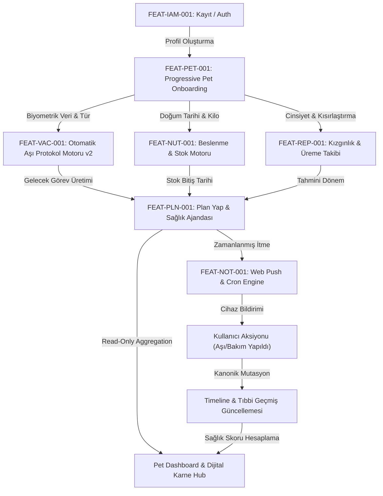

# Odi Pet - Feature Dependency Graph & Architecture Flow

> **Doküman Tipi:** Architecture & Feature Dependency Documentation  
> **Sürüm:** 2.0 (Forensic Audit Certified)  
> **Kapsam:** Özellik Bağımlılıkları, Tetikleme Zincirleri, Kritik Akış Yolları ve Veri Mimarısı  
> **Kanıt Seviyesi Etiketleri:** `CONFIRMED`, `HIGH CONFIDENCE`, `INFERRED`

---

## 1. Ana Kritik Yol Akışı (Primary Critical Path Flow)

Odi Pet ekosisteminde kullanıcı etkileşimi, veri üretimi ve arka plan otomasyonları aşağıdaki zincirleme kritik yol üzerinden ilerler:



---

## 2. Özellik Bağımlılık ve Tetikleme Matrisi (Upstream & Downstream Table)

| Özellik (Feature ID & Adı) | Doğrudan Bağımlı Olduğu Özellikler (Depends On) | Otomatik Tetiklediği Özellikler (Triggers / Downstream) | Etkilenen Veritabanı Tabloları | Kanıt Derecesi & Dosya Yolu |
| :--- | :--- | :--- | :--- | :--- |
| **FEAT-IAM-001: Auth & Login** | Supabase Auth Provider | FEAT-PET-001 (Onboarding Gate) | `auth.users`, `profiles` | `CONFIRMED` — `src/app/login/page.tsx` |
| **FEAT-IAM-002: Family Sharing** | FEAT-IAM-001, FEAT-PET-001 | FEAT-PET-002 (Caregiver Pet Access) | `pet_owners`, `pet_memberships` | `CONFIRMED` — `src/components/pets/family/` |
| **FEAT-PET-001: Pet Add / Onboarding** | FEAT-IAM-001 | FEAT-VAC-001, FEAT-NUT-001, FEAT-REP-001 | `pets`, `pet_owners`, `weight_logs` | `CONFIRMED` — `src/app/owner/pets/add/page.tsx` |
| **FEAT-PET-002: Pet Detail Hub** | FEAT-PET-001 | FEAT-MED-001, FEAT-PLN-001 | `pets`, `growth_records` | `CONFIRMED` — `src/app/owner/pets/[id]/page.tsx` |
| **FEAT-VAC-001: Auto Vaccine Engine** | FEAT-PET-001 (`species`, `birth_date`) | FEAT-PLN-001, FEAT-NOT-001 | `vaccine_templates`, `vaccine_records_v2` | `CONFIRMED` — `src/lib/vaccines/vaccination-algorithm.ts` |
| **FEAT-VAC-002: Parasite Tracker** | FEAT-PET-001 | FEAT-PLN-001, FEAT-NOT-001 | `parasite_protocols`, `parasite_records` | `CONFIRMED` — `src/components/pets/ParasitePlanCompletionModal.tsx` |
| **FEAT-MED-001: Medical History** | FEAT-PET-001 | FEAT-PET-002 (Health Summary Card) | `health_diseases`, `health_allergies` | `CONFIRMED` — `src/components/pets/AllergyManager.tsx` |
| **FEAT-NUT-001: Nutrition & Stock** | FEAT-PET-001 | FEAT-NOT-001 (Low Stock Push Alert) | `pet_food_assignments`, `food_brands` | `CONFIRMED` — `src/components/nutrition/StockTimeline.tsx` |
| **FEAT-NUT-002: Weight Target Band** | FEAT-PET-001 | FEAT-PET-002 (Growth Chart Rendering) | `weight_logs` | `CONFIRMED` — `src/components/pets/WeightGoalBand.tsx` |
| **FEAT-CAR-001: Grooming & Care** | FEAT-PET-001 | FEAT-PLN-001 | `care_plans`, `care_events` | `CONFIRMED` — `src/app/owner/pets/[id]/care/CareClient.tsx` |
| **FEAT-PLN-001: Plan Yap & Takvim** | FEAT-VAC-001, FEAT-CAR-001, FEAT-NUT-001 | FEAT-NOT-001, FEAT-PET-002 | `health_schedules`, `plans`, `plan_occurrences` | `CONFIRMED` — `src/app/owner/takvim/TakvimClient.tsx` |
| **FEAT-NOT-001: Push & Cron Engine** | FEAT-PLN-001, VAPID Config | İstemci Push Bildirimi | `device_push_subscriptions`, `notifications` | `CONFIRMED` — `src/components/notifications/PushNotificationPrompt.tsx` |
| **FEAT-AI-001: AI Vet & OCR Scanner** | Gemini Vision API | FEAT-VAC-001 (Review & Confirm UI) | `content_generation_jobs` | `CONFIRMED` — `src/components/ui/SmartScanner.tsx` |
| **FEAT-REP-001: Estrus Cycle Tracker** | FEAT-PET-001 (`gender='female'`, `is_neutered=false`) | FEAT-PLN-001, FEAT-SOC-002 | `pet_estrus_cycles` | `CONFIRMED` — `src/components/estrus-tracker/EstrusTracker.tsx` |
| **FEAT-SOC-001: SOS Lost Pet Beacon** | FEAT-PET-001, Location Service | Public SOS Beacon, Yarıçap Push Alert | `lost_reports` | `CONFIRMED` — `src/components/pets/LostPetWizard.tsx` |
| **FEAT-SOC-002: Social Marketplace** | FEAT-PET-001 | FEAT-IAM-002 | `breeding_listings`, `social_posts` | `CONFIRMED` — `src/components/social/` |
| **FEAT-ADM-001: Orchestrator & Flags** | Admin Role | İstemci Modül Görünürlüğü (Feature Gate) | `feature_registry`, `experience_rules` | `CONFIRMED` — `src/components/orchestrator/DynamicExperienceEngine.tsx` |

---

## 3. Modüller Arası Veri ve Olay Akış Mimarisi

### 3.1 Aşı Kaydı & Otomasyon Veri Akış Şeması
```
[Kullanıcı / OCR Tarayıcı]
         │
         ▼
[Review & Confirm Modal (Human-in-the-Loop UI)]
         │ (Kullanıcı Onayı)
         ▼
[Kanonik Mutation Service: createVaccineRecord()]
         │
         ├───► [DB Insert: vaccine_records_v2] (Kanonik Tablo)
         │
         ├───► [Vaccine Protocol Engine: recalculateNextDueDate()]
         │           │
         │           ▼
         │     [DB Update: next_due_date]
         │
         └───► [Plan & Agenda View: Read-Only Aggregation]
                     │
                     ▼
               [Cron Engine: Send Web Push Notification]
```

### 3.2 Beslenme & Stok Yenileme Tetikleme Akışı
```
[Pet Food Assignment Created] ──► [Stock Refill Engine Calculation]
                                         │
                                         ▼
                             [Daily Stock Decrement (Virtual)]
                                         │
                                         ▼
                            [Remaining Days <= 3 Threshold?]
                                     /       \
                                  YES         NO
                                  /             \
 [SmartCardBanner Triggered] ◄───┘               └──► [Normal State]
            │
            ▼
 [Push Alert: Food Refill Warning]
```

---

## 4. Mimari Katman Sorumlulukları & Bağımlılık İzolasyonu

1. **Client / UI Components Layer (`src/components/`, `src/app/(app)/`):**
   - Kullanıcı etkileşimini toplar.
   - Doğrudan veritabanı mutasyonları YAPMAZ.
   - Form validasyonları ve visual indicator (Mor Yıldız `Sparkles`, Badge, State) yönetimi yapar.

2. **API & Service Layer (`src/app/api/`, `src/lib/`):**
   - Kanonik mutasyon servislerini (`createPet.ts`, `createVaccineRecord.ts` vb.) barındırır.
   - İş kurallarını (WSAVA kuralları, Yaş skalası, RLS denetimi) doğrular.

3. **Database Layer (Supabase Postgres):**
   - Single Source of Truth (SSOT) kanonik tablolar.
   - Row Level Security (RLS) ile yetkisiz okuma/yazma erişimini kesin olarak engeller.
   - Arşivleme politikası (`is_archived = true`) ile veri kaybını sıfıra indirir.

4. **Background & Cron Orchestrator (`src/lib/cron/`, Vercel Cron):**
   - Zamanlanmış görevleri (aşı hatırlatıcıları, stok uyarıları, doğum günü tebrikleri) otonom olarak yürütür.
