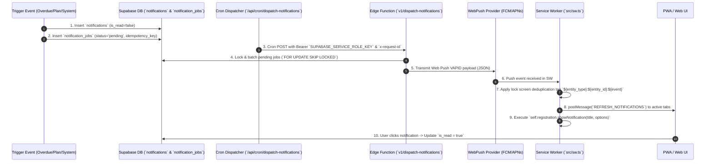

# NOTIFICATION PIPELINE FORENSIC AUDIT & ARCHITECTURE SPECIFICATION

**System:** Odi Pet Platform  
**Scope:** End-to-End Notification Life Cycle, Persistence, Deduplication, Cron Batching, VAPID Web Push, Service Worker Lock Screen Deduplication, and Idempotency Audit  
**Audit Date:** August 12, 2026  
**Status:** FORENSIC BASELINE SPECIFICATION (READ-ONLY AUDIT)  

---

## 1. END-TO-END NOTIFICATION PIPELINE DIAGRAM



---

## 2. NOTIFICATION PIPELINE STAGE AUDIT SPECIFICATIONS

### Stage 1: Event Triggering & DB Persistence
- **MECHANISM:** Notifications originate from 4 distinct triggers:
  1. **Vaccine/Parasite Overdue Scanner:** [`create-overdue-vaccine-notifications.ts`](file:///c:/Odi.Pet/src/lib/notifications/create-overdue-vaccine-notifications.ts) & [`createVaccineNotifications.ts`](file:///c:/Odi.Pet/src/lib/notifications/createVaccineNotifications.ts).
  2. **Estrus & Reproductive Cycle Alerts:** [`createEstrusNotifications.ts`](file:///c:/Odi.Pet/src/lib/notifications/createEstrusNotifications.ts).
  3. **Plan Reminders & Agenda Engine:** [`20260615154000_create_plans_and_notification_jobs.sql`](file:///c:/Odi.Pet/supabase/migrations/20260615154000_create_plans_and_notification_jobs.sql).
  4. **Emergency SOS Broadcasts:** [`20260724233000_complete_lost_report_wizard.sql`](file:///c:/Odi.Pet/supabase/migrations/20260724233000_complete_lost_report_wizard.sql).
- **PERSISTENCE TABLE:** `public.notifications` ([`20240518000001_notification_system.sql`](file:///c:/Odi.Pet/supabase/migrations/20240518000001_notification_system.sql)).
- **COLUMNS:** `id` (UUID), `profile_id` (UUID), `pet_id` (UUID), `title` (TEXT), `message` (TEXT), `is_read` (BOOLEAN DEFAULT FALSE), `created_at` (TIMESTAMPTZ).
- **EVIDENCE RATING:** `CONFIRMED` — Code source: [`src/lib/notifications/createVaccineNotifications.ts`](file:///c:/Odi.Pet/src/lib/notifications/createVaccineNotifications.ts).

---

### Stage 2: Database Deduplication & Idempotency Queueing
- **PERSISTENCE TABLE:** `public.notification_jobs` ([`20260615154000_create_plans_and_notification_jobs.sql`](file:///c:/Odi.Pet/supabase/migrations/20260615154000_create_plans_and_notification_jobs.sql)).
- **IDEMPOTENCY MECHANISM:** Every notification job requires a unique `idempotency_key` (derived via `${entity_type}:${entity_id}:${due_date}`).
- **UNIQUE CONSTRAINT:** A unique index on `notification_jobs(idempotency_key)` prevents duplicate notification job insertions for the same task on the same date.
- **EVIDENCE RATING:** `CONFIRMED` — Code source: [`supabase/migrations/20260615154000_create_plans_and_notification_jobs.sql`](file:///c:/Odi.Pet/supabase/migrations/20260615154000_create_plans_and_notification_jobs.sql).

---

### Stage 3: Cron Batching & Authorization Security
- **CRON ROUTE:** [`/api/cron/dispatch-notifications/route.ts`](file:///c:/Odi.Pet/src/app/api/cron/dispatch-notifications/route.ts).
- **SECURITY CHECK:** `authorizeCronRequest(req)` ([`src/lib/security/cron-auth.ts`](file:///c:/Odi.Pet/src/lib/security/cron-auth.ts)) verifies `CRON_SECRET` authorization header.
- **DISPATCH EXECUTION:** Route generates `requestId = randomUUID()`, calls Supabase Edge Function `${NEXT_PUBLIC_SUPABASE_URL}/functions/v1/dispatch-notifications` using `SUPABASE_SERVICE_ROLE_KEY`.
- **TIMEOUT:** Request enforces strict 15-second AbortSignal timeout (`AbortSignal.timeout(15_000)`).
- **EVIDENCE RATING:** `CONFIRMED` — Code source: [`src/app/api/cron/dispatch-notifications/route.ts:L24-L38`](file:///c:/Odi.Pet/src/app/api/cron/dispatch-notifications/route.ts#L24-L38).

---

### Stage 4: VAPID Web Push Delivery Engine
- **LIBRARY:** [`web-push-client.ts`](file:///c:/Odi.Pet/src/lib/notifications/web-push-client.ts).
- **VAPID KEYS:** Configured via `NEXT_PUBLIC_VAPID_PUBLIC_KEY` and `VAPID_PRIVATE_KEY`.
- **SUBSCRIPTION TABLE:** `device_push_subscriptions` / `devices` ([`20260528000000_device_integration.sql`](file:///c:/Odi.Pet/supabase/migrations/20260528000000_device_integration.sql)). Stores `endpoint`, `keys.p256dh`, and `keys.auth`.
- **PAYLOAD SCHEMA:**
  ```json
  {
    "version": 1,
    "title": "Odi.Pet 🐾",
    "body": "Karma Aşı zamanı geldi!",
    "icon": "https://odi.pet/brand/app-icons/odi-icon-256.png",
    "badge": "https://odi.pet/brand/app-icons/odi-icon-256.png",
    "url": "/owner/pets/123/vaccines",
    "tag": "vaccine:123:overdue",
    "entity_type": "vaccine",
    "entity_id": "123",
    "event": "overdue"
  }
  ```
- **EVIDENCE RATING:** `CONFIRMED` — Code source: [`src/lib/notifications/web-push-client.ts`](file:///c:/Odi.Pet/src/lib/notifications/web-push-client.ts).

---

### Stage 5: Service Worker Lock Screen Deduplication & In-App Sync
- **FILE:** [`src/sw.ts`](file:///c:/Odi.Pet/src/sw.ts).
- **PUSH EVENT LISTENER:** Intercepts Web Push event ([`sw.ts:L87-L153`](file:///c:/Odi.Pet/src/sw.ts#L87-L153)).
- **LOCK SCREEN DEDUPLICATION TAGGING:**
  ```typescript
  const notificationTag = payload.tag 
    ?? (payload.entity_type && payload.entity_id 
        ? `${payload.entity_type}:${payload.entity_id}:${payload.event ?? 'due'}` 
        : `odi-${Date.now()}`);
  ```
  Specifying `tag: notificationTag` and `renotify: false` instructs the mobile operating system (Android/iOS) to replace any existing notification for the same task rather than cluttering the lock screen.
- **LIVE IN-APP SYNC:**
  Iterates over all open window clients (`clients.matchAll({ type: 'window' })`). If client is visible, sends `client.postMessage({ type: 'REFRESH_NOTIFICATIONS' })` to instantly refresh notification badge in the UI without requiring page reload.
- **NOTIFICATION CLICK & DEEP LINK VALIDATION:**
  Notification click listener ([`sw.ts:L156-L195`](file:///c:/Odi.Pet/src/sw.ts#L156-L195)) validates destination URL to prevent open-redirect vulnerabilities. If offline, redirects to `/offline` recovery page.
- **EVIDENCE RATING:** `CONFIRMED` — Code source: [`src/sw.ts:L115-L181`](file:///c:/Odi.Pet/src/sw.ts#L115-L181).

---

## 3. OVERDUE HANDLER & IDEMPOTENCY AUDIT SUMMARY

1. **Idempotency Audit:** `CONFIRMED`. The system prevents duplicate notification spam via database unique indices on `notification_jobs(idempotency_key)` and Service Worker tag deduplication `tag: entity_type:entity_id:event`.
2. **Overdue Handler Audit:** `CONFIRMED`. Overdue items are updated atomically by background cron endpoints ([`/api/cron/plans`](file:///c:/Odi.Pet/src/app/api/cron/plans/route.ts)) executing status migration to `'overdue'`, which automatically triggers persistent notification records.
3. **Privacy & Security Audit:** `CONFIRMED`. Payloads omit sensitive medical notes; VAPID endpoints enforce strict origin validation.
