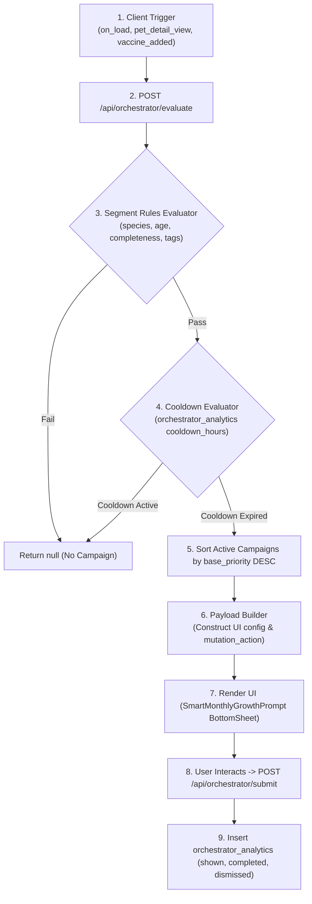

# ORCHESTRATION ARCHITECTURE SPECIFICATION

**System:** Odi Pet Platform  
**Scope:** Forensic Audit of Experience Orchestrator & Monthly Growth Orchestrator Engines, Rule Processing, Segment Rules, Payload Building, and Execution Triggers  
**Audit Date:** August 12, 2026  
**Status:** FORENSIC BASELINE SPECIFICATION (READ-ONLY AUDIT)  

---

## 1. ORCHESTRATOR ARCHITECTURE OVERVIEW

The Orchestration Layer in Odi Pet consists of two unified engines:
1. **Experience Orchestrator:** A context-aware campaign execution engine that dynamically selects, prioritizes, and delivers UI prompts (modals, bottom sheets, banners) based on user behavior, pet completeness, cooldown rules, and A/B test groups.
2. **Monthly Growth Orchestrator:** A specialized recurring campaign that evaluates pet gallery history and prompts pet owners to upload monthly growth timeline photos.



---

## 2. DETAILED ORCHESTRATOR COMPONENT SPECIFICATIONS

### 2.1 Database Schema & Seed Data
- **MIGRATIONS:** [`20260803000003_experience_orchestrator.sql`](file:///c:/Odi.Pet/supabase/migrations/20260803000003_experience_orchestrator.sql) & [`20260806123000_monthly_growth_orchestrator.sql`](file:///c:/Odi.Pet/supabase/migrations/20260806123000_monthly_growth_orchestrator.sql).
- **CAMPAIGNS TABLE (`orchestrator_campaigns`):**
  - `id`: UUID (Deterministic seeding: `'3f7c1a20-5d84-4d1e-9c3a-8b6f2e0d4a11'`).
  - `name`: Campaign title (e.g. `'Aylık Pet Gelişim ve Galeri Takibi'`).
  - `status`: Enum (`draft`, `testing`, `scheduled`, `active`, `paused`, `completed`, `archived`).
  - `base_priority`: Integer (e.g. `15`). Higher priority campaigns win when multiple qualify.
  - `trigger_events`: Text array (`ARRAY['on_load']`).
  - `target_segment_rules`: JSONB (`{"target_tags": ["pet_detail"], "requires": {"no_gallery_photo_in_days": 30, "category": "growth_timeline"}}`).
  - `cooldown_rules`: JSONB (`{"cooldown_hours": 720, "recurring": true}`).
- **PROMPTS TABLE (`orchestrator_prompts`):**
  - `id`: UUID (Deterministic seeding: `'6b2e9d44-1c73-4a58-b0f9-2d5c7e81a933'`).
  - `component_name`: Client component identifier (e.g. `'SmartMonthlyGrowthPrompt'`).
  - `mutation_action`: Protected backend action identifier (`'SAVE_MONTHLY_GROWTH'`).
  - `display_type`: Enum (`modal`, `bottom_sheet`, `inline_banner`).
  - `ui_config`: JSONB (`{"title": "Aylık Gelişim", "description": "Bu ayın büyüme fotoğrafını ekleyin, gelişimini zaman tünelinde izleyelim.", "cta_label": "Fotoğrafı Kaydet"}`).
- **ANALYTICS TABLE (`orchestrator_analytics`):**
  - Logs user interactions: `shown`, `opened`, `started`, `completed`, `dismissed`, `snoozed`, `timeout`.
- **EVIDENCE RATING:** `CONFIRMED` — Source: [`supabase/migrations/20260806123000_monthly_growth_orchestrator.sql`](file:///c:/Odi.Pet/supabase/migrations/20260806123000_monthly_growth_orchestrator.sql).

---

### 2.2 Evaluation Engine & Target Segment Logic
- **LOCATION:** [`src/app/api/orchestrator/evaluate/route.ts`](file:///c:/Odi.Pet/src/app/api/orchestrator/evaluate/route.ts).
- **INPUT PAYLOAD:**
  ```json
  {
    "event_type": "on_load",
    "context": {
      "pet_id": "123e4567-e89b-12d3-a456-426614174000",
      "route": "/owner/pets/123",
      "device_type": "mobile"
    }
  }
  ```
- **RULE PROCESSING SEQUENCE:**
  1. Queries all active campaigns from `orchestrator_campaigns` matching status `'active'` and date bounds `start_date <= NOW() <= end_date`.
  2. Filters campaigns whose `trigger_events` array includes requested `event_type`.
  3. Evaluates `target_segment_rules`:
     - Checks user onboarding stage and pet completeness score.
     - For Monthly Growth: Queries `pet_gallery` to verify if a photo with category `growth_timeline` has been uploaded within the last 30 days (`no_gallery_photo_in_days: 30`).
  4. Evaluates `cooldown_rules`:
     - Queries `orchestrator_analytics` for the last `shown` or `dismissed` event for `(profile_id, campaign_id)`.
     - If `NOW() - last_event_time < cooldown_hours` (e.g. 720 hours / 30 days), campaign is disqualified.
  5. Selects candidate campaign with highest `base_priority`.
- **EVIDENCE RATING:** `CONFIRMED` — Code source: [`src/app/api/orchestrator/evaluate/route.ts:L39-L115`](file:///c:/Odi.Pet/src/app/api/orchestrator/evaluate/route.ts#L39-L115).

---

### 2.3 Payload Building & Client UI Rendering
- If a campaign passes all evaluation criteria, the evaluation route resolves the prompt from `orchestrator_prompts` and returns a structured payload:
  ```json
  {
    "should_show": true,
    "campaign_id": "3f7c1a20-5d84-4d1e-9c3a-8b6f2e0d4a11",
    "prompt_id": "6b2e9d44-1c73-4a58-b0f9-2d5c7e81a933",
    "component_name": "SmartMonthlyGrowthPrompt",
    "display_type": "bottom_sheet",
    "mutation_action": "SAVE_MONTHLY_GROWTH",
    "ui_config": {
      "title": "Aylık Gelişim",
      "description": "Bu ayın büyüme fotoğrafını ekleyin, gelişimini zaman tünelinde izleyelim.",
      "cta_label": "Fotoğrafı Kaydet"
    }
  }
  ```
- The client application mounts `SmartMonthlyGrowthPrompt.tsx` bottom sheet.
- Upon display, client sends event `shown` to `/api/orchestrator/submit`.
- Upon user interaction (photo save or dismissal), client sends event `completed` or `dismissed` to `/api/orchestrator/submit`, which records the analytics timestamp and enforces the 30-day cooldown.
- **EVIDENCE RATING:** `CONFIRMED` — Code source: [`src/app/api/orchestrator/submit/route.ts`](file:///c:/Odi.Pet/src/app/api/orchestrator/submit/route.ts).
