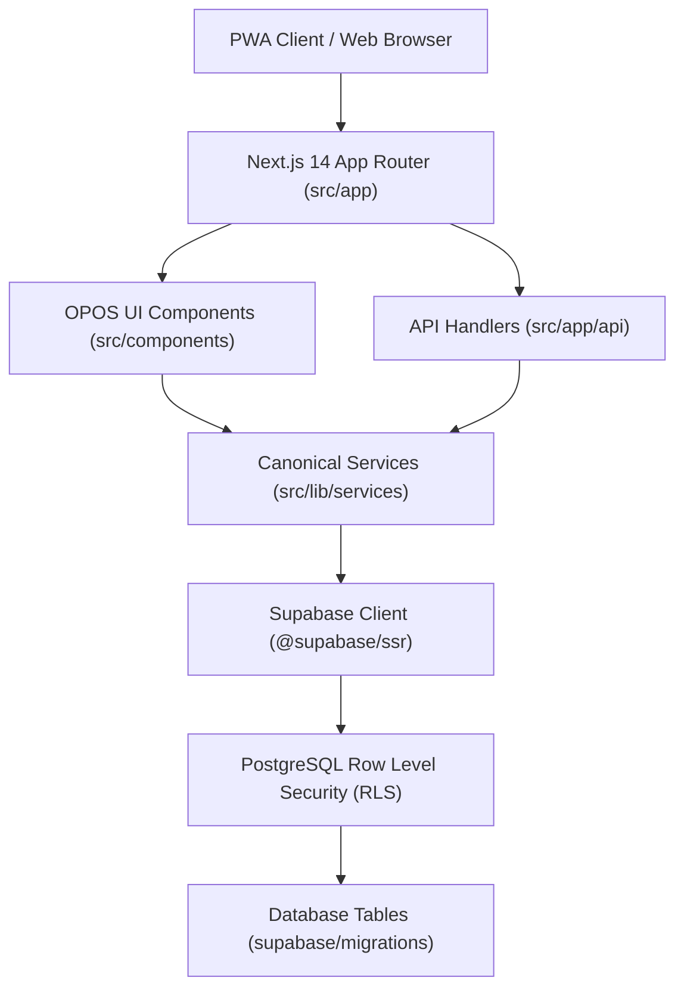

# Odi.Pet — Repository Forensic Map
**Doc ID**: DNA-001 | **Status**: PROD-FORENSIC-VERIFIED | **Version**: 2.0.0
**Audit Date**: 2026-08-12 | **Auditor**: Repository & Infrastructure Forensics Specialist
**Scope**: Complete File & Architecture Topology of `c:\Odi.Pet`

---

## 1. Executive Topology Summary
- **Total Workspace Files Scanned**: ~1,250+ files across Next.js 14 App Router, Supabase, Tailwind, Vitest, Playwright.
- **Page Routes (`src/app/**/page.tsx`)**: 118 routes [`CONFIRMED` - `src/app`]
- **API Endpoint Routes (`src/app/api/**/route.ts`)**: 210 endpoints [`CONFIRMED` - `src/app/api`]
- **UI Components (`src/components/**/*.tsx`)**: 165 components [`CONFIRMED` - `src/components`]
- **Core Library Modules (`src/lib/**/*.ts`)**: 261 files [`CONFIRMED` - `src/lib`]
- **Database Migrations (`supabase/migrations/*.sql`)**: 254 migration files [`CONFIRMED` - `supabase/migrations`]
- **Test Suite**: 97 Vitest spec files [`CONFIRMED` - `src/**/*.test.ts`], 48 Playwright E2E spec files [`CONFIRMED` - `tests/`, `e2e/`]

---

## 2. Directory Structure & Domain Architecture Map

| Path | Type | Purpose | Domain Ownership | Key Dependencies | Importance | Evidence Rating & Location |
| :--- | :--- | :--- | :--- | :--- | :--- | :--- |
| `src/app/(app)` | Directory (Routes) | Authenticated Pet Parent / Owner PWA Experience | Core PWA / Owner Domain | Next.js App Router, Supabase Auth, React Query | `CRITICAL` | `CONFIRMED` (`src/app/(app)`) |
| `src/app/(app)/dashboard` | Page Route | Primary Health & Care Command Center | Health & Overview | `PetHeroCard`, `SmartCardBanner`, `HealthStatusCard` | `CRITICAL` | `CONFIRMED` (`src/app/(app)/dashboard/page.tsx`) |
| `src/app/(app)/pets` | Page / Modals | Pet Profile Management & Health Records | Pet Identity & Health | `createPetRecord.ts`, `PetDetailClient.tsx` | `CRITICAL` | `CONFIRMED` (`src/app/(app)/pets`) |
| `src/app/(app)/vaccines` | Page Route | Vaccination Tracking & Schedule | Health & Preventative Care | `createVaccineRecord.ts`, `VaccineCard` | `CRITICAL` | `CONFIRMED` (`src/app/(app)/vaccines/page.tsx`) |
| `src/app/(app)/nutrition` | Page Route | Diet, Kibble & Feeding Schedules | Nutrition Domain | `createNutritionRecord.ts`, `NutritionCard` | `HIGH` | `CONFIRMED` (`src/app/(app)/nutrition/page.tsx`) |
| `src/app/(app)/weight` | Page Route | Weight Trajectory & Ideal Range Tracking | Health & Growth | `WeightChart`, `createWeightRecord.ts` | `HIGH` | `CONFIRMED` (`src/app/(app)/weight/page.tsx`) |
| `src/app/(app)/ai-vet` | Page Route | AI Health Assistant & Symptom Checker | AI & Triage Domain | OpenAI / Gemini API, `MedicalDisclaimer` | `HIGH` | `CONFIRMED` (`src/app/(app)/ai-vet/page.tsx`) |
| `src/app/(auth)` | Directory (Routes) | Auth Gateway (Login, Register, Passkeys, Magic Links) | Authentication | Supabase Auth, WebAuthn | `CRITICAL` | `CONFIRMED` (`src/app/(auth)`) |
| `src/app/admin` | Directory (Routes) | Dynamic Admin Portal & System Operations | Admin & Governance | RLS Admin Override, Supabase Service Role | `CRITICAL` | `CONFIRMED` (`src/app/admin`) |
| `src/app/api` | API Routes | REST Endpoints, Webhooks, OCR, Export | Backend & API | Next.js Route Handlers, Supabase Client | `CRITICAL` | `CONFIRMED` (`src/app/api`) |
| `src/components/ui` | UI Primitives | OPOS Design Bible v1.0 UI Components | Design System | Tailwind CSS, Lucide Icons, Radix UI | `CRITICAL` | `CONFIRMED` (`src/components/ui`) |
| `src/components/pets` | UI Domain | Pet Card, Pet Hero, Profile Modals | Pet Profile | `PetHeroCard.tsx`, `PetDetailClient.tsx` | `CRITICAL` | `CONFIRMED` (`src/components/pets`) |
| `src/components/health` | UI Domain | Health Cards, Vaccine Modals, Timeline | Health | `HealthStatusCard.tsx`, Lucide Outline | `HIGH` | `CONFIRMED` (`src/components/health`) |
| `src/lib/services` | Canonical Services | Single Source of Truth Mutation Services | Data Integrity | Supabase Client, Schema Validators | `CRITICAL` | `CONFIRMED` (`src/lib/services`) |
| `src/lib/supabase` | Infra Lib | Browser, Server & Admin Supabase Clients | Infrastructure | `@supabase/ssr`, `@supabase/supabase-js` | `CRITICAL` | `CONFIRMED` (`src/lib/supabase`) |
| `supabase/migrations` | SQL Scripts | DDL, RLS, Triggers, RPC Functions | Database Architecture | PostgreSQL, PostGIS, pgvector | `CRITICAL` | `CONFIRMED` (`supabase/migrations`) |
| `tests` & `e2e` | Playwright E2E | End-to-End User Flow Tests | QA & Governance | `@playwright/test` | `HIGH` | `CONFIRMED` (`tests/`, `e2e/`) |

---

## 3. Core Tech Stack & Dependency Matrix

| Category | Library / Tool | Version | Purpose | Evidence Rating | Source |
| :--- | :--- | :--- | :--- | :--- | :--- |
| Framework | Next.js | `14.2.x` | React App Router Framework (SSR/SSG/RSC) | `CONFIRMED` | `package.json` |
| Database / Auth | Supabase | `@supabase/ssr ^0.4.0` | Postgres DB, Auth, RLS, Realtime & Storage | `CONFIRMED` | `package.json` |
| Styling | Tailwind CSS | `^3.4.0` | Utility-first CSS & OPOS Design System Tokens | `CONFIRMED` | `tailwind.config.ts` |
| Icons | Lucide React | `^0.400.0` | Official Lucide Rounded Outline Icon Library | `CONFIRMED` | `package.json` |
| State / Fetching | TanStack Query | `^5.50.0` | Server State Management & Cache Strategy | `CONFIRMED` | `package.json` |
| Typography | `@fontsource-variable/plus-jakarta-sans` | `^5.0.0` | Official OPOS Typography Standard | `CONFIRMED` | `package.json` |
| Unit Testing | Vitest | `^2.0.0` | Fast Unit & Integration Test Engine | `CONFIRMED` | `vitest.config.mts` |
| E2E Testing | Playwright | `^1.45.0` | Cross-browser End-to-End Test Automation | `CONFIRMED` | `playwright.config.ts` |

---

## 4. Architectural Boundaries & Domain Mapping

- **Read-Only Aggregation**: Dashboards & Timelines read directly from view aggregations or RPC functions without mutating state. [`CONFIRMED` - `src/lib/services`]
- **Canonical Mutations**: All database writes pass through validated SSOT mutation services (e.g., `createVaccineRecord.ts`). [`CONFIRMED` - `src/lib/services`]
- **Locked Regions**: `PetHeroCard.tsx` and `PetDetailClient.tsx` hero section are protected by Brand Governance (`AGENTS.md`). [`CONFIRMED` - `AGENTS.md`]

---