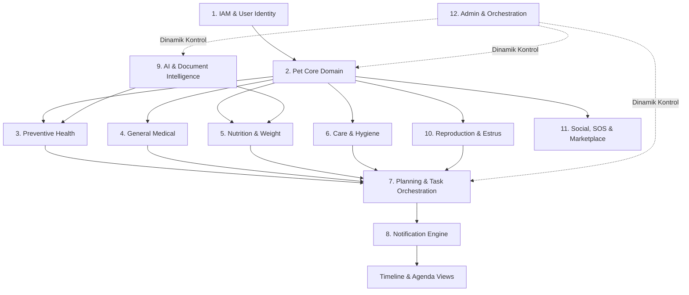

# Odi Pet — Domain Architecture & Boundaries

> **Sürüm:** 2.0.0-AI  
> **Konum:** `c:\Odi.Pet\docs\product-dna\claude-package\02_DOMAINS.md`  
> **Kapsam:** 12 Ana Domain, Entity İlişkileri ve Sorumluluk Haritası  

---

## 1. Domain Bağımlılık Haritası (Mermaid Dependency Graph)

---

## 2. 12 Ana Domain Spesifikasyonu

### 2.1 IAM & User Identity Domain
- **Sorumluluk:** Kullanıcı kimlik doğrulama, profil yönetimi, yetkilendirme (RBAC), davetiyeler ve aile paylaşımı.
- **Varlıklar (Entities):** `Profile`, `UserRole`, `FamilyMember`, `PetOwner`, `ReferralCode`
- **Veritabanı Tabloları:** `profiles`, `pet_owners`, `pet_invites`, `referral_codes`, `referral_usages`
- **Kod Konumları:** `src/lib/auth/`, `src/lib/security/`, `src/app/api/auth/`

### 2.2 Pet Core Domain
- **Sorumluluk:** Evcil hayvan dijital kimliği, ırk/tür kısıtlamaları (Kedi/Köpek), mikroçip, fotoğraflar, fiziksel ölçümler.
- **Varlıklar (Entities):** `Pet`, `PetBreed`, `PetAvatar`, `PetMembership`, `GrowthRecord`
- **Veritabanı Tabloları:** `pets`, `pet_owners`, `pet_memberships`, `growth_records`
- **Kod Konumları:** `src/lib/pets/`, `src/lib/species.ts`, `src/app/api/pets/`

### 2.3 Preventive Health Domain (Aşı & Parazit)
- **Sorumluluk:** Karma aşı, kuduz, lösemi, iç/dış parazit protokolleri, markalar, rutin tekrarlar, tıbbi aşı onayları.
- **Varlıklar (Entities):** `VaccineRecord`, `VaccineProtocol`, `ParasiteRecord`, `ParasiteProtocol`, `VaccineBrand`
- **Veritabanı Tabloları:** `vaccines`, `vaccine_records_v2`, `vaccine_protocols`, `vaccine_brands`, `parasite_protocols`, `parasite_records`
- **Kod Konumları:** `src/lib/vaccines/`, `src/lib/health/`, `src/app/api/pets/[id]/vaccines/`

### 2.4 General Medical & Health History Domain
- **Sorumluluk:** Geçirilmiş veya kronik hastalıklar, bilinen alerjiler, aktif reçeteli ilaçlar, operasyonlar ve klinik notlar.
- **Varlıklar (Entities):** `Disease`, `Allergy`, `Medication`, `Treatment`, `HealthReport`
- **Veritabanı Tabloları:** `health_diseases`, `health_allergies`, `health_medications`, `health_reports`
- **Kod Konumları:** `src/lib/health-records/`, `src/lib/treatments/`

### 2.5 Nutrition & Weight Management Domain
- **Sorumluluk:** Mama markaları kataloğu, günlük porsiyon/beslenme planı, mama stok takip (refill engine), kilo takibi.
- **Varlıklar (Entities):** `FoodCatalog`, `PetFoodAssignment`, `WeightLog`, `FoodInventory`, `RefillAlert`
- **Veritabanı Tabloları:** `food_manufacturers`, `food_brands`, `pet_food_assignments`, `pet_food_inventory`, `weight_logs`
- **Kod Konumları:** `src/lib/nutrition/`, `src/app/api/pets/[id]/nutrition/`

### 2.6 Care & Hygiene Domain
- **Sorumluluk:** Rutin banyo, tırnak kesimi, tüy tarama, göz/kulak hijyeni, diş fırçalama periyotları ve görev takibi.
- **Varlıklar (Entities):** `CarePlan`, `CareEvent`, `HygieneTask`
- **Veritabanı Tabloları:** `care_plans`, `care_events`
- **Kod Konumları:** `src/lib/modules/`, `src/app/api/pets/[id]/care-plan/`

### 2.7 Planning & Task Orchestration Domain
- **Sorumluluk:** Aşı, parazit, beslenme ve bakım protokollerinden türetilen zamanlanmış görevler, ajanda ve takvim yönetimi.
- **Varlıklar (Entities):** `Plan`, `Task`, `ScheduleItem`, `CalendarOccurrence`
- **Veritabanı Tabloları:** `health_schedules`, `plans`, `plan_occurrences`
- **Kod Konumları:** `src/lib/plans/`, `src/lib/tasks/`, `src/lib/agenda/`

### 2.8 Notification & Engine Domain
- **Sorumluluk:** Gecikmiş (overdue) ve yaklaşan görevler için Web Push, in-app ve cron tabanlı bildirim iletimi, VAPID.
- **Varlıklar (Entities):** `Notification`, `NotificationJob`, `PushSubscription`
- **Veritabanı Tabloları:** `notifications`, `notification_jobs`, `device_push_subscriptions`
- **Kod Konumları:** `src/lib/notifications/`, `src/lib/cron/`

### 2.9 AI & Document Intelligence Domain
- **Sorumluluk:** Aşı karnesi ve tıbbi belgelerden OCR (Gemini) ile veri çıkarma, akıllı beslenme önerileri, HITL UI onay sistemi.
- **Varlıklar (Entities):** `OCRScanJob`, `AIInsight`, `SmartScanner`
- **Veritabanı Tabloları:** `content_generation_jobs`, `source_verification_audits`
- **Kod Konumları:** `src/lib/content/`, `src/lib/insight-engine.ts`, `src/app/api/scan-document/`

### 2.10 Reproduction & Estrus Domain
- **Sorumluluk:** Dişi kedi/köpeklerde kızgınlık (estrus) dönemi tahmini, üreme testleri ve sağlık onaylı eşleşme ilanları.
- **Varlıklar (Entities):** `EstrusCycle`, `BreedingListing`, `BreedingApplication`
- **Veritabanı Tabloları:** `pet_estrus_cycles`, `breeding_listings`, `breeding_applications`
- **Kod Konumları:** `src/services/estrus/`, `src/services/breeding/`

### 2.11 Social, SOS & Marketplace Domain
- **Sorumluluk:** Sosyal medya paylaşımları, kayıp pet acil durum (SOS) ilanları, 7/24 nöbetçi veteriner dizini ve randevular.
- **Varlıklar (Entities):** `SocialPost`, `LostReport`, `VetClinic`, `Appointment`
- **Veritabanı Tabloları:** `social_posts`, `lost_reports`, `clinics`, `appointments`
- **Kod Konumları:** `src/lib/social/`, `src/lib/lost-reports/`, `src/lib/vets/`

### 2.12 Admin & Experience Orchestration Domain
- **Sorumluluk:** Özellik bayrakları (Feature Registry), A/B pop-up ve dinamik anket yönetimi (Soru yorgunluğu denetimi).
- **Varlıklar (Entities):** `FeatureFlag`, `OrchestratorRule`, `UserSurveyStat`
- **Veritabanı Tabloları:** `feature_registry`, `experience_rules`, `user_survey_stats`
- **Kod Konumları:** `src/lib/architecture/`, `src/lib/profiling-engine.ts`, `src/app/admin/`
