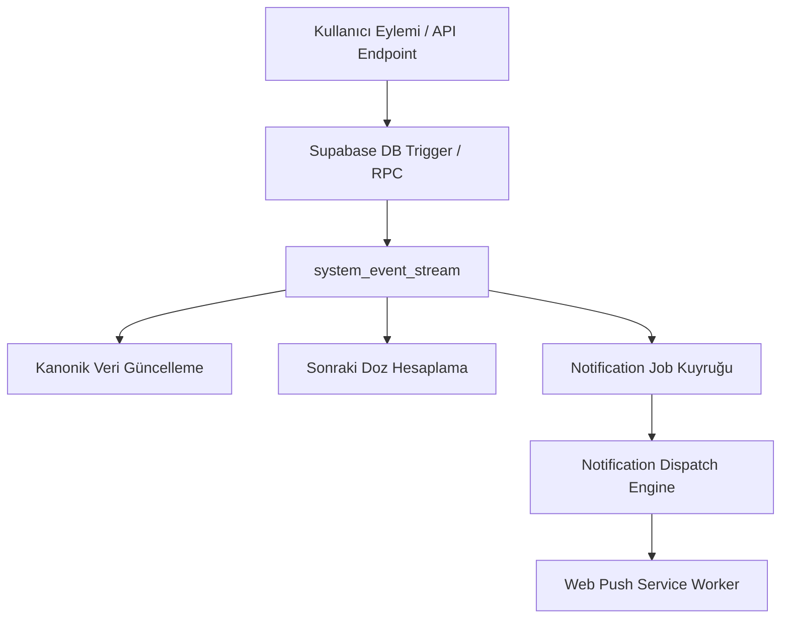

# Odi Pet — Event System, Triggers & Side-Effects

> **Sürüm:** 2.0.0-AI  
> **Konum:** `c:\Odi.Pet\docs\product-dna\claude-package\07_EVENT_SYSTEM.md`  
> **Kapsam:** Sistem Olayları, Otomatik Tetikleyiciler ve Yan Etkiler  

---

## 1. Olay Mimarisi Genel Bakış (Event Architecture)

Odi Pet olay sistemi, kullanıcı eylemleri ve cron zamanlamalarından türeyen olayları (Events) yakalayarak veri tabanında zincirleme yan etki (Cascading Side-Effects) ve zamanlanmış bildirim işleri (`notification_jobs`) üreten yapıdır.



---

## 2. Sistem Olay Kataloğu ve Yan Etki Haritası

| Olay Adı (Event Name) | Tetikleyici Durum | Zincirleme Yan Etkiler (Cascading Actions) | Idempotency Anahtarı |
| :--- | :--- | :--- | :--- |
| `PET_CREATED` | Yeni pet profili oluşturulduğunda | Petin türüne (Kedi/Köpek) ve yaşına göre standart aşı/parazit şablonları `health_schedules` tablosuna aktarılır. | `pet_init_{pet_id}` |
| `VACCINE_COMPLETED` | Kullanıcı bir aşıyı tamamlandı işaretlediğinde | 1. Kanonik `vaccine_records_v2` kaydı yazılır.<br>2. `complete_recurring_plan_rpc` sonraki doz tarihini hesaplar.<br>3. Yeni `UPCOMING` plan açılır. | `vac_comp_{record_id}` |
| `PARASITE_LOGGED` | Parazit damlası kaydedildiğinde | Tür kısıtına göre (ör. Kedi için 2 ay, Köpek için 3 ay) bir sonraki parazit tarihi hesaplanır ve bildirim kuyruğuna yazılır. | `par_log_{record_id}` |
| `FOOD_PORTION_DEDUCTED` | Günlük porsiyon düşüldüğünde | Stok miktarı güncellenir. Kalan stok %15 altına inerse `LOW_STOCK_REFILL_ALERT` olayı tetiklenir. | `food_deduct_{assignment_id}_{date}` |
| `OCR_DOC_SCANNED` | Gemini OCR belgeyi taradığında | Veriler saklanmaz; geçici `AI Taslak İnceleme Modalı` event'i ile UI'a `Sparkles` payload'ı iletilir. | `ocr_scan_{job_id}` |
| `LOST_PET_REPORTED` | SOS ilanı yayınlandığında | 10 km yarıçapındaki tüm aktif PWA kullanıcılarına yüksek öncelikli Web Push bildirimi iletilir. | `lost_sos_{report_id}` |
| `FAMILY_INVITE_ACCEPTED` | Aile davet kodu onaylandığında | `pet_owners` tablosuna `co_owner` kaydı düşer, RLS politikaları anında ikincil kullanıcıyı kapsar. | `invite_acc_{invite_id}` |

---

## 3. Örnek Olay Payload Şemaları

### `VACCINE_COMPLETED` Payload Şeması
```json
{
  "event": "VACCINE_COMPLETED",
  "timestamp": "2026-08-12T11:00:00Z",
  "pet_id": "9b1deb4d-3b7d-4149-9cd6-123456789abc",
  "vaccine_name": "Karma Aşı (Rabies + DHPP)",
  "administered_at": "2026-08-12",
  "calculated_next_due": "2027-08-12",
  "idempotency_key": "vac_comp_9b1deb4d_20260812"
}
```

---

## 4. İdemopotensi ve Yan Yanlış Tetiklenme Koruması

Her olay çalıştırılmadan önce `notification_jobs` veya `event_stream` tablosundaki `idempotency_key` kontrol edilir. Eğer aynı anahtarla bir işlem daha önce `processing` veya `delivered` durumuna geçmişse, mükerrer bildirim veya çift plan kaydı engellenir.
