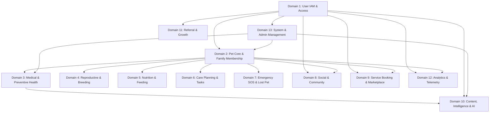
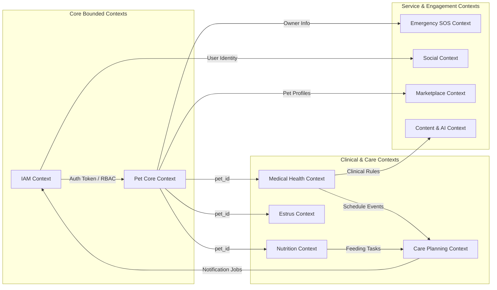
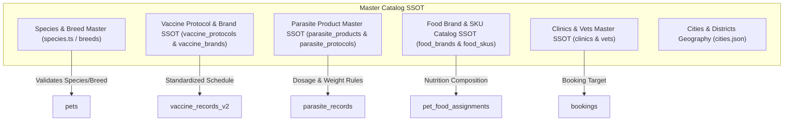
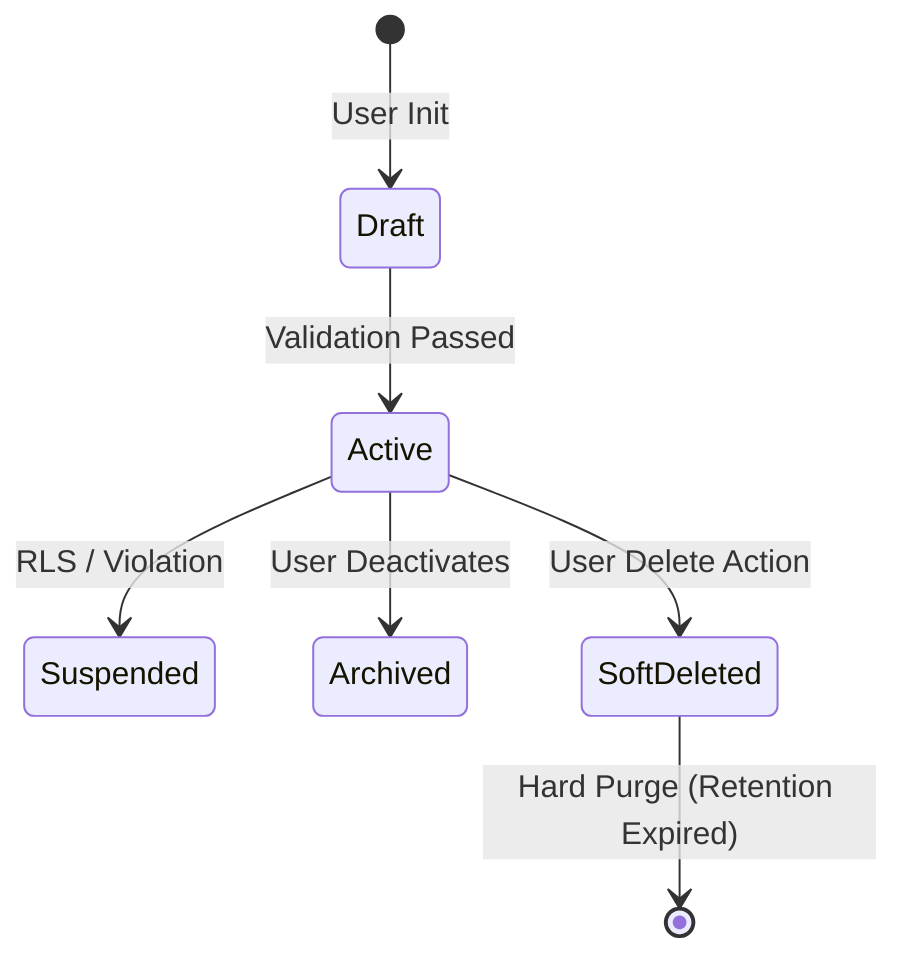
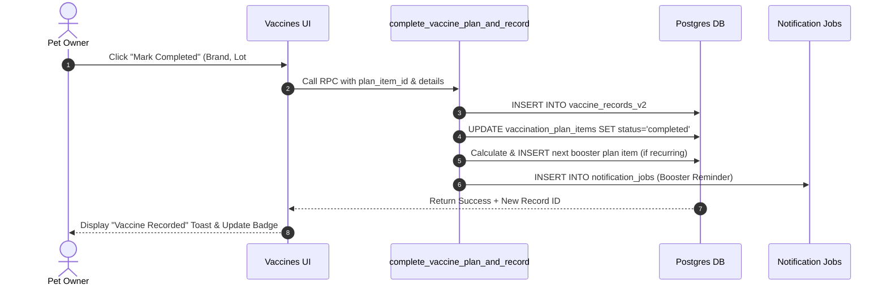
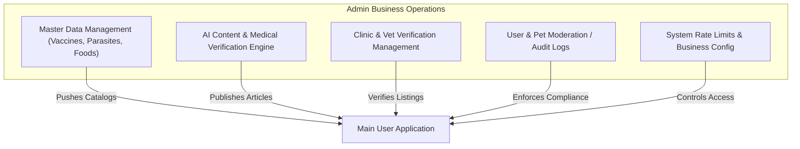
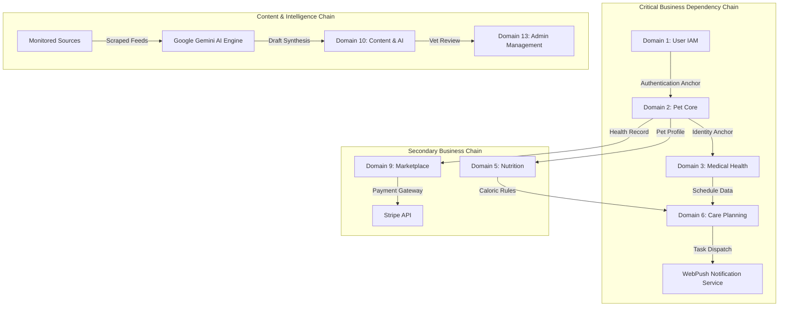

# ODI PET — PHASE 1.3 DOMAIN & BUSINESS ARCHITECTURE AUDIT
**VERSION:** 1.0  
**DATE:** July 31, 2026  
**ROLE:** Independent Principal Domain Architect, Enterprise Architect & Business Systems Analyst  
**SCOPE:** Read-Only Domain & Business Architecture Inventory & Capability Mapping  
**STATUS:** OFFICIAL DOMAIN & BUSINESS ARCHITECTURE BASELINE REPORT  

---

## EXECUTIVE SUMMARY & AUDIT MANDATE

This document establishes the official **Domain & Business Architecture Baseline Report** for **Odi Pet**. Prepared strictly as a **read-only, evidence-based architectural audit**, this document outlines:
1. **How the business is currently modeled** across data entities, business workflows, bounded contexts, and domain ownership.
2. **How data flows** between user touchpoints, backend services, automated engines, and back-office administrative portals.
3. **Who owns the data** from both business and technical perspectives, including system-generated and AI-synthesized objects.
4. **Which business domains exist** and how they interact to deliver pet health, medical care, nutrition, social, emergency, and marketplace capabilities.
5. **How the application supports future analytics** by mapping current data collection granularity, historical depth, anonymization suitability, and dimension readiness.

### Strict Audit Boundaries Applied:
- **NO Code Generation or Modification:** The current codebase is analyzed strictly as-is.
- **NO Architectural Redesign or Refactoring:** Existing patterns are documented without restructuring.
- **NO OPOS Comparisons:** Analysis is confined exclusively to the Odi Pet repository state.
- **NO Future Feature Proposals or Roadmaps:** Capabilities are mapped solely based on currently implemented database tables, APIs, services, hooks, and workflows.

---

## TABLE OF CONTENTS

- [BOOK 1: DOMAIN MAP](#book-1-domain-map)
- [BOOK 2: BOUNDED CONTEXT ANALYSIS](#book-2-bounded-context-analysis)
- [BOOK 3: BUSINESS ENTITY MODEL](#book-3-business-entity-model)
- [BOOK 4: AGGREGATE ROOT ANALYSIS](#book-4-aggregate-root-analysis)
- [BOOK 5: OWNERSHIP ANALYSIS](#book-5-ownership-analysis)
- [BOOK 6: CANONICAL DATA MODEL](#book-6-canonical-data-model)
- [BOOK 7: DATA LIFECYCLE](#book-7-data-lifecycle)
- [BOOK 8: BUSINESS WORKFLOW MAP](#book-8-business-workflow-map)
- [BOOK 9: EVENT ARCHITECTURE](#book-9-event-architecture)
- [BOOK 10: INSIGHT READINESS](#book-10-insight-readiness)
- [BOOK 11: ADMIN BUSINESS MODEL](#book-11-admin-business-model)
- [BOOK 12: BUSINESS DEPENDENCY MAP](#book-12-business-dependency-map)
- [BOOK 13: DATA GOVERNANCE INVENTORY](#book-13-data-governance-inventory)
- [BOOK 14: ANALYTICS READINESS](#book-14-analytics-readiness)

---

## BOOK 1: DOMAIN MAP

Odi Pet comprises **13 primary business domains**. Each domain encompasses specialized business responsibilities, data entities, database tables, API handlers, frontend user interfaces, services, background processes, and back-office administrative tools.

### 1.1 Detailed Domain Inventory

#### Domain 1: User Identity & Access Management (IAM)
- **Purpose:** Manages user authentication, profile identity, authorization roles, user onboarding progression, and access security across Web and PWA platforms.
- **Responsibilities:** User registration, OAuth login, passkey/biometric authentication, role-based access control (RBAC), user session tracking, push device registration, and progressive profiling consent.
- **Main Entities:** User Profile, User Role, Device Subscription, Security Audit Log, User Activation Score.
- **Related Tables:** `profiles`, `user_subscriptions`, `user_badges`, `user_activation_scores`, `user_onboarding_steps`, `user_survey_stats`, `devices`, `push_subscriptions`, `security_audit_logs`, `session_logs`.
- **Related APIs:** `/api/auth/*`, `/api/user/*`, `/api/users/*`.
- **Related Screens:** `/login`, `/register`, `/reset-password`, `/update-password`, `/owner/profile`.
- **Related Services:** `auth-security.ts`, `useWebPush.ts`, `CameraProvider.ts`.
- **Related Admin Pages:** `/admin/users`, `/admin/onboarding`, `/admin/audit-logs`.
- **Related Notifications:** Welcome emails, login security alerts, auth verification push notifications.
- **Related AI Features:** Progressive profiling survey prompt generator (`profiling-engine.ts`).
- **Dependencies:** Supabase Auth (`auth.users`), WebPush VAPID service.

#### Domain 2: Pet Core & Family Membership Domain
- **Purpose:** Acts as the central domain for pet digital profiles, multi-owner family sharing, caregiver invitations, and pet card distribution.
- **Responsibilities:** Pet profile creation, species/breed categorization, neutering status tracking, avatar photo management, multi-user membership management (Owner, Co-Owner, Caregiver, Reader), invitation link lifecycle, and pet identity verification.
- **Main Entities:** Pet, Pet Membership, Shared Pet Card, Pet Invite, Pet Gallery.
- **Related Tables:** `pets`, `pet_memberships`, `pet_members`, `pet_membership_events`, `pet_membership_issues`, `shared_pet_cards`, `pet_invites`, `pet_gallery`, `pet_owners`.
- **Related APIs:** `/api/pets/*`, `/api/invite/*`, `/api/share/*`.
- **Related Screens:** `/owner/pets`, `/owner/pets/add`, `/owner/pets/[id]`, `/invite/*`.
- **Related Services:** `useOnboardingProgress.ts`, `useOnboarding.ts`.
- **Related Admin Pages:** `/admin/pets`.
- **Related Notifications:** Caregiver invitation alerts, co-owner acceptance notifications.
- **Related AI Features:** Smart avatar scanner and pet profile completeness evaluator (`calculate_completeness_score`).
- **Dependencies:** User IAM Domain, Storage Bucket (`pet_gallery_bucket`).

#### Domain 3: Medical & Preventive Health Domain (Vaccines & Parasites)
- **Purpose:** Governs all medical history, clinical protocols, core/non-core vaccination schedules, internal/external parasite treatment regimes, allergies, and diagnostic records.
- **Responsibilities:** Clinical protocol lookup by species/breed/age, automated vaccine calendar generation, parasite dosage calculation based on pet weight/age, medical document storage, custom vaccine template handling, and health schedule completion.
- **Main Entities:** Vaccine Protocol, Vaccine Brand, Vaccination Record, Parasite Protocol, Parasite Product, Parasite Record, Health Allergy, Health Schedule, Health Medication, Health Treatment.
- **Related Tables:** `vaccine_protocols`, `vaccine_brands`, `vaccination_plan_items`, `vaccine_records_v2`, `pet_vaccine_preferences`, `vaccine_catalog_suggestions`, `parasite_protocols`, `parasite_products`, `parasite_product_suggestions`, `parasite_records`, `pet_parasite_preferences`, `health_records`, `health_plans`, `health_schedules`, `health_allergies`, `health_diseases`, `health_measurements`, `health_medications`, `health_treatments`.
- **Related APIs:** `/api/vaccines/*`, `/api/vaccination/*`, `/api/vaccine-suggestions/*`, `/api/parasite-suggestions/*`, `/api/symptoms/*`.
- **Related Screens:** `/owner/pets/[id]/vaccines`, `/owner/pets/[id]/parasites`, `/owner/pets/[id]/health`.
- **Related Services:** `useHealthTracker.ts`, `vaccine-rules.ts`.
- **Related Admin Pages:** `/admin/vaccines`, `/admin/parasite-products`, `/admin/health`.
- **Related Notifications:** Vaccination due reminders, parasite administration due alerts, overdue booster notifications.
- **Related AI Features:** Medical document OCR scanner (`/api/scan-document/route.ts`), symptom risk classifier (`predictive-risk`).
- **Dependencies:** Pet Core Domain, Care Planning Domain.

#### Domain 4: Reproductive & Breeding Domain (Estrus & Heat Tracking)
- **Purpose:** Tracks female pet estrus cycles, calculates reproductive heat forecasts, evaluates mating eligibility based on health criteria, and manages breeding applications.
- **Responsibilities:** Heat observation logging, ovulation window prediction, reproductive test metadata indexing, breeding consent registration, breeding listing management, and application matching.
- **Main Entities:** Pet Estrus Cycle, Heat Observation, Reproductive Test, Mating Eligibility Record, Breeding Listing, Breeding Application.
- **Related Tables:** `pet_estrus_cycles`, `pet_estrus_observations`, `pet_estrus_preferences`, `pet_reproductive_tests`, `pet_breeding_eligibility`, `breeding_listings`, `breeding_applications`, `breeding_consent_records`.
- **Related APIs:** `/api/breeding-listings/*`, `/api/breeding-applications/*`.
- **Related Screens:** `/owner/pets/[id]/estrus`, `/owner/social/breeding`.
- **Related Services:** `useEstrusTracker.ts`, `useReproductiveForecast.ts`, `calculateReproductiveForecast.ts`, `evaluateBreedingEligibility.ts`, `createEstrusNotifications.ts`.
- **Related Admin Pages:** `/admin/pets` (Breeding filter flag).
- **Related Notifications:** Proestrus start alerts, peak fertility window push notifications, breeding application response alerts.
- **Related AI Features:** Algorithmic heat forecast mathematical model (`calculateReproductiveForecast.ts`).
- **Dependencies:** Pet Core Domain, Medical & Preventive Health Domain.

#### Domain 5: Nutrition & Feeding Management Domain
- **Purpose:** Manages pet dietary profiles, commercial pet food catalogs, daily feeding logs, food swap transitions, weight goal matching, and daily caloric calculations.
- **Responsibilities:** Master catalog indexing of pet food SKUs and brands, active food assignment, transition schedule calculation (7-day swap rule), daily food consumption logging, and nutritional adequacy verification.
- **Main Entities:** Food Brand, Food SKU, Food Manufacturer, Pet Food Assignment, Nutrition Log, Daily Feeding Log.
- **Related Tables:** `food_brands`, `food_manufacturers`, `food_product_families`, `food_skus`, `food_brand_aliases`, `food_label_versions`, `food_inventory`, `pet_food_assignments`, `nutrition_logs`, `pet_nutrition_logs`, `pet_nutrition_profiles`, `feeding_logs`.
- **Related APIs:** `/api/nutrition/*`.
- **Related Screens:** `/owner/pets/[id]/nutrition`.
- **Related Services:** `swap_pet_food_assignment`, `end_pet_food_assignment`.
- **Related Admin Pages:** `/admin/content` (Catalog management).
- **Related Notifications:** Low inventory alerts, food transition stage reminders, daily feeding reminders.
- **Related AI Features:** Caloric demand calculator based on pet size, age, activity level, and neutering status.
- **Dependencies:** Pet Core Domain, Care Planning Domain.

#### Domain 6: Care Planning & Task Management Domain
- **Purpose:** Acts as the central scheduling and task orchestration engine for routine pet care, recurring habits, growth measurements, and calendar synchronization.
- **Responsibilities:** Automated recurring plan generation, task status management (Pending, Completed, Overdue, Dismissed), calendar feed token generation (iCal), weight tracking, and micro-task prompt scheduling.
- **Main Entities:** Care Plan, Task, Notification Job, Calendar Feed Token, Weight Log.
- **Related Tables:** `plans`, `notification_jobs`, `pet_care_tasks`, `pet_care_events`, `care_plans`, `care_events`, `weight_logs`, `growth_records`, `calendar_feed_tokens`.
- **Related APIs:** `/api/plans/*`, `/api/tasks/*`, `/api/agenda/*`, `/api/calendar/*`.
- **Related Screens:** `/owner/plan-yap`, `/owner/events`.
- **Related Services:** `service.ts` (Plan Service), `pet-agenda-service.ts`, `write-service.ts`, `useDismissedMicroTasks.ts`.
- **Related Admin Pages:** `/admin/plans`.
- **Related Notifications:** Task due alerts, morning daily agenda push digests, overdue task escalation.
- **Related AI Features:** Adaptive habit frequency engine (`predictive_insights`).
- **Dependencies:** Pet Core Domain, Medical Domain, Nutrition Domain.

#### Domain 7: Emergency SOS & Lost Pet Domain
- **Purpose:** Facilitates rapid response mechanisms when a pet is lost or facing an immediate health emergency.
- **Responsibilities:** Lost pet report creation, geo-located broadcast alerts, emergency contact list management, public SOS pet poster generation, and community sighting coordination.
- **Main Entities:** Lost Pet Report, Contact, Sighting Draft, Public SOS View.
- **Related Tables:** `lost_reports`, `lost_report_contacts`, `lost_report_drafts`, `sos_public_view` (view).
- **Related APIs:** `/api/sos/*`.
- **Related Screens:** `/sos`, `/owner/lost-report`, `FloatingSOS.tsx`, `FloatingLostPets.tsx`.
- **Related Services:** `can_publish_pet_lost_report` RPC.
- **Related Admin Pages:** `/admin/pets` (Lost Pet Flags).
- **Related Notifications:** Emergency push broadcast to nearby owners, contact notification SMS/Push.
- **Related AI Features:** Emergency triage bot in AI Vet.
- **Dependencies:** Pet Core Domain, User IAM Domain.

#### Domain 8: Social & Community Domain
- **Purpose:** Connects pet owners through community posts, pet interactions, social feed engagement, messaging, and adoption listings.
- **Responsibilities:** Social post creation, media attachment, comment moderation, post likes, pet matching, adoption application processing, and direct messaging between owners.
- **Main Entities:** Social Post, Post Comment, Post Like, Conversation, Message, Adoption Application.
- **Related Tables:** `social_posts`, `post_comments`, `post_likes`, `conversations`, `messages`, `pet_matches`, `pet_adoptions`, `adoption_applications`.
- **Related APIs:** `/api/social/*`, `/api/messages/*`, `/api/adoption-applications/*`.
- **Related Screens:** `/owner/social`, `/owner/messages`.
- **Related Services:** Realtime Supabase socket listeners.
- **Related Admin Pages:** `/admin/content` (Social Moderation).
- **Related Notifications:** Post like alerts, comment notifications, adoption response push alerts.
- **Related AI Features:** Automated post content moderation and toxicity filter.
- **Dependencies:** User IAM Domain, Pet Core Domain.

#### Domain 9: Service Booking & Marketplace Domain
- **Purpose:** Connects pet owners with verified veterinary clinics, groomers, pet sitters, hotels, trainers, and pet products.
- **Responsibilities:** Business profile registration, clinic membership verification, appointment scheduling, service pricing catalog, review submission, and Stripe payment processing.
- **Main Entities:** Clinic Profile, Vet Profile, Marketplace Product, Booking, Appointment, Vet Earnings, Payment Record.
- **Related Tables:** `marketplace_products`, `marketplace_clicks`, `marketplace_waitlist`, `business_profiles`, `business_availability`, `clinics`, `vets`, `vet_verifications`, `vet_status`, `vet_earnings`, `vet_reviews`, `clinic_memberships`, `bookings`, `appointments`, `payments`, `stripe_webhook_events`.
- **Related APIs:** `/api/marketplace/*`, `/api/bookings/*`, `/api/vets/*`, `/api/vet/*`, `/api/payments/*`.
- **Related Screens:** `/owner/marketplace`, `/owner/vets`, `/clinic/*`, `/groomer/*`, `/hotel/*`, `/sitter/*`, `/trainer/*`.
- **Related Services:** Stripe Webhook Handler (`/api/payments/webhook/route.ts`).
- **Related Admin Pages:** `/admin/businesses`, `/admin/clinics`, `/admin/bookings`, `/admin/revenue`.
- **Related Notifications:** Booking confirmation push alerts, appointment reminders, payment receipt emails.
- **Related AI Features:** Smart vet search and appointment time recommendation engine.
- **Dependencies:** User IAM Domain, Pet Core Domain, Stripe API.

#### Domain 10: Content, Medical Intelligence & AI Domain
- **Purpose:** Synthesizes evidence-based veterinary articles, processes medical document scans (OCR), powers the conversational AI Vet assistant, and manages medical content publishing workflows.
- **Responsibilities:** Medical web source monitoring, automated AI article generation, veterinary source verification audits, manual admin override logs, OCR document parsing, and interactive medical chat sessions.
- **Main Entities:** Article, Article Source, Content Generation Job, Verification Audit, Smart Scanner Record, AI Usage Log.
- **Related Tables:** `articles`, `article_revisions`, `article_sources`, `article_media`, `article_saves`, `article_pet_states`, `monitored_sources`, `discovered_external_contents`, `content_generation_jobs`, `content_generation_job_sources`, `content_source_verification_audits`, `admin_vet_override_logs`, `smart_scanner_records`, `ai_usage_logs`.
- **Related APIs:** `/api/ai-vet/*`, `/api/scan-document/*`, `/api/articles/*`, `/api/hints/*`.
- **Related Screens:** `/owner/ai-vet`, `/owner/scanner`, `/owner/learn`, `/admin/content`, `/admin/ai-vet`, `/admin/intelligence`.
- **Related Services:** `userHealthAgent.ts`, `contentResearchService.ts`, `jobPipelineService.ts`, `sourceVerificationService.ts`, `sourceArticleGenerator.ts`.
- **Related Admin Pages:** `/admin/content`, `/admin/intelligence`, `/admin/ai-vet`.
- **Related Notifications:** Published article alerts, scanner extraction completed notifications.
- **Related AI Features:** Google Gemini 1.5/2.0 API integration, pgvector semantic search, OCR regex parser.
- **Dependencies:** User IAM Domain, Pet Core Domain, Google Gemini API, Storage (`article-media`).

#### Domain 11: Referral & Growth Domain
- **Purpose:** Drives platform growth through user referral campaigns, reward point distribution, outreach pipeline tracking, and activation metrics.
- **Responsibilities:** Unique referral code generation, invite link attribution, care points accumulation, promotional reward redemption, outreach stage tracking, and onboarding activation scoring.
- **Main Entities:** Referral, Referral Reward, Outreach Pipeline Entry, Activation Metric.
- **Related Tables:** `referrals`, `referral_rewards`, `outreach_pipeline`, `beta_signups`, `activation_metrics`, `user_activation_scores`, `funnel_events`, `step_events`.
- **Related APIs:** `/api/referral/*`.
- **Related Screens:** `/owner/referral`, `DashboardPendingReferral.tsx`.
- **Related Services:** `useReferralCapture.ts`, `increment_care_points` RPC.
- **Related Admin Pages:** `/admin/outreach`, `/admin/onboarding`.
- **Related Notifications:** Referral success alerts, reward point credit notifications.
- **Related AI Features:** User conversion likelihood score calculation.
- **Dependencies:** User IAM Domain.

#### Domain 12: Analytics & System Telemetry Domain
- **Purpose:** Collects operational telemetry, user interaction events, data quality monitoring, and system audit logs.
- **Responsibilities:** In-app telemetry logging, page view tracking, event stream ingestion, daily active metric aggregation, data quality config execution, and security event auditing.
- **Main Entities:** Event Stream Entry, Daily User Metric, Security Audit Log, Data Quality Config.
- **Related Tables:** `event_stream`, `daily_user_metrics`, `data_quality_configs`, `security_audit_logs`.
- **Related APIs:** `/api/analytics/*`.
- **Related Screens:** None directly (Background ingestion).
- **Related Services:** `useAnalytics.ts`.
- **Related Admin Pages:** `/admin/system-health`, `/admin/data-quality`, `/admin/audit-logs`.
- **Related Notifications:** System anomaly alerts to admin console.
- **Related AI Features:** Automated data quality anomaly detection.
- **Dependencies:** All System Domains.

#### Domain 13: System & Admin Management Domain
- **Purpose:** Provides comprehensive back-office operational control, system limits management, data catalog maintenance, and administrative auditing.
- **Responsibilities:** Global configuration enforcement, master data catalog curation, user role elevation, audit trail review, rate limit configuration, and system health monitoring.
- **Main Entities:** Admin Audit Log, Onboarding Limit, Data Quality Rule.
- **Related Tables:** `admin_audit_logs`, `onboarding_limits`, `data_quality_configs`.
- **Related APIs:** `/api/admin/*`.
- **Related Screens:** `/admin/*` (22 Admin Control Panels).
- **Related Services:** `AdminSidebarNav.tsx`, `DashboardClient.tsx`.
- **Related Admin Pages:** Entire `/admin/` route hierarchy.
- **Related Notifications:** Internal admin alert broadcasts.
- **Related AI Features:** Admin AI job pipeline manager.
- **Dependencies:** System IAM, Supabase RLS bypass (service_role).

---

### 1.2 Domain Hierarchy Diagram

---

## BOOK 2: BOUNDED CONTEXT ANALYSIS

Every domain operates within a defined **Bounded Context** with distinct boundaries, entity definitions, coupling characteristics, and communication patterns.

### 2.1 Bounded Context Specifications

| Bounded Context | Context Boundary | Primary Responsibilities | External Dependencies | Shared Entities | Cross-Domain Communication | Ownership & Coupling |
| :--- | :--- | :--- | :--- | :--- | :--- | :--- |
| **IAM Context** | `profiles`, `user_subscriptions`, Auth endpoints | User authentication, identity, RBAC, sessions | Supabase Auth, WebPush | `user_id`, `profile_id` | Synchronous Auth Headers / JWT tokens | Owned by Security Team. **Low Coupling**. |
| **Pet Core Context** | `pets`, `pet_memberships`, `/api/pets` | Pet identity, multi-owner RBAC, profile access | IAM Context | `pet_id`, `profile_id` | Foreign Keys, Database Triggers, Atomic RPCs | Owned by Core Product Team. **High Central Coupling** (Anchor Context). |
| **Medical Health Context** | `vaccine_*`, `parasite_*`, `health_*` | Clinical schedules, protocol matching, medical records | Pet Core Context, Storage | `pet_id`, `vaccine_id`, `protocol_id` | Plan RPCs (`complete_vaccine_plan_and_record`), Plan Sync | Owned by Medical Domain Team. **Medium Coupling** (Depends on Pet Core). |
| **Estrus & Breeding Context**| `pet_estrus_*`, `breeding_*` | Heat cycle forecasting, mating eligibility, consent | Pet Core, Medical Context | `pet_id`, `cycle_id` | API queries to Medical for health check | Owned by Health Services Team. **Medium Coupling**. |
| **Nutrition Context** | `food_*`, `pet_food_assignments`, `nutrition_logs` | Catalog management, 7-day food swap, feeding logs | Pet Core Context | `pet_id`, `sku_id` | RPCs (`swap_pet_food_assignment`), Care Plan sync | Owned by Nutrition Team. **Medium Coupling**. |
| **Care Planning Context** | `plans`, `notification_jobs`, `weight_logs` | Task scheduling, recurring plan engine, iCal | Pet Core, Medical, Nutrition Contexts | `pet_id`, `plan_id` | Webhooks, Cron Jobs, Push Notifications | Owned by Core Engine Team. **High Coupling** (Aggregates tasks). |
| **Emergency SOS Context** | `lost_reports`, `sos_public_view` | Lost pet declarations, public emergency pages | Pet Core Context | `pet_id`, `report_id` | Broadcast Push Notifications, Public Web URLs | Owned by Safety Team. **Low Coupling** (Standalone execution). |
| **Social & Community Context**| `social_posts`, `messages`, `pet_adoptions` | Social feed, comments, user messaging, adoption | IAM Context, Pet Core | `profile_id`, `pet_id`, `post_id` | Realtime WebSockets, In-App Notifications | Owned by Community Team. **Low Coupling**. |
| **Marketplace Context** | `clinics`, `vets`, `bookings`, `payments` | Business directories, vet bookings, payments | IAM, Pet Core, Stripe API | `profile_id`, `clinic_id`, `booking_id` | Stripe Webhooks, Cron SLA check | Owned by Business Operations. **Medium Coupling**. |
| **Content & AI Context** | `articles`, `content_generation_jobs`, AI Vet | Source indexing, AI synthesis, medical chat | Gemini API, pgvector, Medical Context | `article_id`, `job_id` | Asynchronous Job Pipeline, REST RPCs | Owned by AI/Content Team. **Medium Coupling**. |
| **Referral & Growth Context** | `referrals`, `outreach_pipeline`, `activation_*` | Referral codes, rewards, activation funnels | IAM Context | `profile_id`, `referral_id` | RPC (`increment_care_points`), Web Hooks | Owned by Growth Team. **Low Coupling**. |
| **Analytics Context** | `event_stream`, `daily_user_metrics` | Event logging, telemetry, audit streams | All Contexts | `event_id`, `profile_id` | Asynchronous Event Emitters, Client Hooks | Owned by Data Engineering. **Loose Coupling**. |
| **Admin Context** | `/admin/*`, `admin_audit_logs` | System monitoring, catalog override, moderation | All Contexts | All Master Entities | Service Role Direct DB Access, Admin API | Owned by System Admins. **High System Access**. |

---

### 2.2 Context Interaction Diagram

---

## BOOK 3: BUSINESS ENTITY MODEL

This book documents **every primary business entity** implemented in Odi Pet.

### 3.1 Entity Definitions & Lifecycles

#### Entity 1: User / Profile (`profiles`)
- **Purpose:** Represents a registered human user (Pet Owner, Co-Owner, Caregiver, Vet, Admin).
- **Lifecycle:** Created upon Auth signup -> Profile completed -> Role updated -> Active usage -> Soft/Hard deletion upon account removal.
- **Owner:** User (Self) / System IAM.
- **Storage:** Table `public.profiles` (FK to `auth.users.id`).
- **Relationships:** Has many `pets` (via `pet_memberships`), has one `user_subscriptions`, has many `notifications`, has many `social_posts`.
- **Used by:** All application modules.
- **Created by:** Supabase Auth Trigger (`on_auth_user_created`).
- **Updated by:** User Profile Page (`/owner/profile`), Admin Console.
- **Deleted by:** Account Deletion API / Admin.

#### Entity 2: Pet Profile (`pets`)
- **Purpose:** Core entity representing an individual animal (Dog, Cat, etc.).
- **Lifecycle:** Draft Onboarding -> Active Profile -> Shared with Caregivers -> Archiving/Deceased state.
- **Owner:** Primary Pet Owner (User).
- **Storage:** Table `public.pets`.
- **Relationships:** Has many `pet_memberships`, `vaccine_records_v2`, `parasite_records`, `pet_food_assignments`, `plans`, `weight_logs`, `pet_estrus_cycles`, `lost_reports`.
- **Used by:** Pet Detail, Medical, Nutrition, Plans, Estrus, SOS, Social modules.
- **Created by:** Atomic RPC `create_pet_with_primary_membership` / Pet Add Wizard.
- **Updated by:** Pet Edit Page (`/owner/pets/[id]/edit`), Pet Profile Form.
- **Deleted by:** Atomic RPC `delete_pet_with_memberships`.

#### Entity 3: Vaccination Plan Item & Record (`vaccination_plan_items`, `vaccine_records_v2`)
- **Purpose:** Represents an upcoming or completed immunization for a pet.
- **Lifecycle:** Scheduled from Protocol -> Pending Task -> Completed via RPC -> Recorded with brand/batch details.
- **Owner:** Pet Owner / Caregiver.
- **Storage:** Tables `public.vaccination_plan_items` and `public.vaccine_records_v2`.
- **Relationships:** Belongs to `pets`, references `vaccine_protocols` and `vaccine_brands`.
- **Used by:** Vaccines Screen, Health Dashboard, Care Agenda.
- **Created by:** Vaccine Engine / RPC `complete_vaccine_plan_and_record`.
- **Updated by:** User Vaccine Modal / Admin Catalog.
- **Deleted by:** Pet Owner / Admin override.

#### Entity 4: Parasite Protocol & Record (`parasite_protocols`, `parasite_records`)
- **Purpose:** Governs internal (worms) and external (fleas/ticks) parasite prevention treatments.
- **Lifecycle:** Protocol assigned -> Recurring Schedule created -> Product selected -> Completed via RPC -> Historical record locked.
- **Owner:** Pet Owner / Caregiver.
- **Storage:** Tables `public.parasite_protocols`, `public.parasite_products`, `public.parasite_records`.
- **Relationships:** Belongs to `pets`, references `parasite_products`.
- **Used by:** Parasites Screen, Health Tracker.
- **Created by:** Parasite Protocol Engine / RPC `complete_parasite_plan_and_record`.
- **Updated by:** User Parasite Form.
- **Deleted by:** User / Admin.

#### Entity 5: Nutrition Assignment & Food SKU (`pet_food_assignments`, `food_skus`)
- **Purpose:** Represents the pet's active commercial food, transition plan, and daily consumption requirements.
- **Lifecycle:** Product selected from catalog -> Active Assignment created -> 7-day transition executed via RPC -> Daily feeding logged -> Swapped to new food.
- **Owner:** Pet Owner.
- **Storage:** Tables `public.food_skus`, `public.pet_food_assignments`, `public.nutrition_logs`.
- **Relationships:** Belongs to `pets`, references `food_skus` and `food_brands`.
- **Used by:** Nutrition Module, Daily Agenda.
- **Created by:** RPC `swap_pet_food_assignment`.
- **Updated by:** Nutrition Log Form.
- **Deleted by:** RPC `end_pet_food_assignment`.

#### Entity 6: Care Plan & Task (`plans`, `pet_care_tasks`)
- **Purpose:** Orchestrates routine pet care tasks (Grooming, Medication, Hygiene, Feeding, Custom reminders).
- **Lifecycle:** Generated automatically or manually created -> Active -> Triggered on scheduled date -> Completed via RPC `complete_recurring_plan` -> Next occurrence auto-generated.
- **Owner:** Pet Owner / Caregiver.
- **Storage:** Tables `public.plans`, `public.pet_care_tasks`, `public.notification_jobs`.
- **Relationships:** Belongs to `pets`, linked to `notifications`.
- **Used by:** Plan-Yap Page, Dashboard Agenda.
- **Created by:** Plan Wizard (`/owner/plan-yap`), RPC Service.
- **Updated by:** User Task Checkbox / Plan Edit Modal.
- **Deleted by:** User Plan Delete API.

#### Entity 7: Estrus Cycle & Heat Observation (`pet_estrus_cycles`, `pet_estrus_observations`)
- **Purpose:** Tracks female pet heat cycles, symptoms, fertility windows, and breeding eligibility.
- **Lifecycle:** Cycle started -> Observations logged -> Peak fertility predicted -> Mating/Fertility ended -> Closed cycle.
- **Owner:** Pet Owner.
- **Storage:** Tables `public.pet_estrus_cycles`, `public.pet_estrus_observations`.
- **Relationships:** Belongs to `pets`, linked to `pet_breeding_eligibility`.
- **Used by:** Estrus Tracker, Mating Module.
- **Created by:** Estrus Log Form / `useEstrusTracker.ts`.
- **Updated by:** Estrus Observation Modal.
- **Deleted by:** Pet Owner.

#### Entity 8: Lost Pet Report (`lost_reports`)
- **Purpose:** Public emergency report when a pet goes missing.
- **Lifecycle:** Draft created -> Published via RPC `can_publish_pet_lost_report` -> Public alert broadcast -> Found status updated -> Resolved/Archived.
- **Owner:** Pet Owner.
- **Storage:** Tables `public.lost_reports`, `public.lost_report_contacts`.
- **Relationships:** Belongs to `pets`, references `profiles`.
- **Used by:** SOS Floating Bar, Lost Pet Screen, Public SOS Page.
- **Created by:** Lost Pet Wizard (`/owner/lost-report`).
- **Updated by:** Owner status update.
- **Deleted by:** Owner resolution / Admin.

#### Entity 9: Article & Content Revision (`articles`, `article_revisions`)
- **Purpose:** Evidence-based medical and care article synthesized for pet owners.
- **Lifecycle:** Job created -> External sources discovered -> AI generated draft -> Source verification audit executed -> Vet/Admin review -> Published -> Revision updated.
- **Owner:** Admin / AI Content Engine.
- **Storage:** Tables `public.articles`, `public.article_revisions`, `public.article_sources`.
- **Relationships:** References `monitored_sources`, linked to `admin_vet_override_logs`.
- **Used by:** Learn Module, AI Vet suggestions, Admin Content Console.
- **Created by:** Admin Content API / RPC `update_article_with_revision`.
- **Updated by:** Admin Content Editor.
- **Deleted by:** Soft delete flag (`is_deleted`).

#### Entity 10: Smart Scanner Record (`smart_scanner_records`)
- **Purpose:** Holds extracted OCR structured medical data from user-uploaded document images/PDFs.
- **Lifecycle:** File uploaded -> Gemini Vision OCR processed -> Regex fields extracted -> User confirmed -> Ingested into Health Records via RPC `process_smart_scan_results`.
- **Owner:** Pet Owner.
- **Storage:** Table `public.smart_scanner_records`, Storage Bucket `pet_gallery_bucket`.
- **Relationships:** Belongs to `pets` and `profiles`.
- **Used by:** Smart Scanner (`/owner/scanner`).
- **Created by:** OCR Upload Route (`/api/scan-document`).
- **Updated by:** User OCR Review Form.
- **Deleted by:** User document deletion.

---

## BOOK 4: AGGREGATE ROOT ANALYSIS

Domain-Driven Design (DDD) principles dictate that data integrity is maintained via **Aggregate Roots**. An Aggregate Root is the primary entry point for modifying a group of related entities.

```mermaid
graph TD
    subgraph Aggregate Roots in Odi Pet
        UserRoot["User Profile Aggregate Root (profiles)"]
        PetRoot["Pet Profile Aggregate Root (pets)"]
        PlanRoot["Care Plan Aggregate Root (plans)"]
        ContentRoot["Article Content Aggregate Root (articles)"]
        BookingRoot["Booking Aggregate Root (bookings)"]
        SOSRoot["Lost Pet Aggregate Root (lost_reports)"]
    end
    
    UserRoot -->|Owns| Devices[devices / push_subscriptions]
    UserRoot -->|Owns| Subscriptions[user_subscriptions]
    
    PetRoot -->|Owns| Memberships[pet_memberships]
    PetRoot -->|Owns| MedicalRecs[vaccine_records_v2 / parasite_records]
    PetRoot -->|Owns| NutritionAssg[pet_food_assignments]
    PetRoot -->|Owns| EstrusCycles[pet_estrus_cycles]
    
    PlanRoot -->|Owns| Tasks[pet_care_tasks]
    PlanRoot -->|Owns| Jobs[notification_jobs]
    
    ContentRoot -->|Owns| Revisions[article_revisions]
    ContentRoot -->|Owns| Sources[content_generation_job_sources]
```

### 4.1 Detailed Aggregate Analysis

#### 1. Pet Profile Aggregate Root (`pets`)
- **Why it is an Aggregate Root:** The `pets` table is the core domain anchor. All medical records, nutrition assignments, estrus cycles, care tasks, and weight logs are cascade-linked to `pets.id`. Modifying or deleting a pet requires atomic cascade enforcement via RPC `delete_pet_with_memberships`.
- **Entities Belonging to this Aggregate:** `pet_memberships`, `vaccine_records_v2`, `parasite_records`, `pet_food_assignments`, `pet_estrus_cycles`, `weight_logs`, `pet_gallery`, `shared_pet_cards`, `pet_breeding_eligibility`.
- **Cross-Aggregate References:** References `profiles.id` (Owner), `vaccine_protocols.id` (Master Catalog), `food_skus.id` (Master Catalog).

#### 2. User Profile Aggregate Root (`profiles`)
- **Why it is an Aggregate Root:** Represents human account identity. Security credentials, role permissions, active push subscriptions, and activation scores are tied directly to `profiles.id`.
- **Entities Belonging to this Aggregate:** `user_subscriptions`, `user_badges`, `user_activation_scores`, `devices`, `push_subscriptions`, `referrals`.
- **Cross-Aggregate References:** References `auth.users.id`.

#### 3. Care Plan Aggregate Root (`plans`)
- **Why it is an Aggregate Root:** Manages the temporal execution lifecycle of routine tasks. A plan controls its scheduled occurrences, notification dispatch jobs, and completion status.
- **Entities Belonging to this Aggregate:** `pet_care_tasks`, `notification_jobs`, `pet_care_events`.
- **Cross-Aggregate References:** References `pets.id`, `profiles.id`.

#### 4. Article Content Aggregate Root (`articles`)
- **Why it is an Aggregate Root:** Governs clinical content publishing. An article maintains version history, external evidence source links, and vet review override logs as an immutable bundle.
- **Entities Belonging to this Aggregate:** `article_revisions`, `article_sources`, `article_media`, `content_source_verification_audits`, `admin_vet_override_logs`.
- **Cross-Aggregate References:** References `monitored_sources.id`, `profiles.id` (Author/Reviewer).

#### 5. Service Booking Aggregate Root (`bookings`)
- **Why it is an Aggregate Root:** Controls commercial appointments between owners and service providers (Vets/Clinics). Holds appointment state, payment logs, and review status.
- **Entities Belonging to this Aggregate:** `appointments`, `payments`, `stripe_webhook_events`.
- **Cross-Aggregate References:** References `profiles.id` (Customer), `clinics.id` / `vets.id` (Provider), `pets.id`.

---

## BOOK 5: OWNERSHIP ANALYSIS

This matrix defines the **Business Owner**, **Technical Owner**, and **CRUD Permission Matrix** for all core data objects.

| Data Object | Business Owner | Technical Owner | Create Perms | Update Perms | Delete Perms | Admin Perms | System Generated? | AI Generated? |
| :--- | :--- | :--- | :--- | :--- | :--- | :--- | :--- | :--- |
| `profiles` | Product / User | IAM Service | Auth Trigger | Self / RLS | Admin Only | Full CRUD | Yes (on Auth) | No |
| `pets` | Pet Owner | Core Engine | Owner (RPC) | Owner/Co-Owner| Primary Owner| Full Control | No | No |
| `pet_memberships` | Pet Owner | Access Control | Primary Owner| Primary Owner| Primary Owner| Full Control | Yes (on Pet create)| No |
| `vaccine_records_v2` | Pet Owner | Medical Module | Owner/Caregiver| Owner/Caregiver| Owner Only | Full Control | Yes (via RPC) | No |
| `parasite_records` | Pet Owner | Medical Module | Owner/Caregiver| Owner/Caregiver| Owner Only | Full Control | Yes (via RPC) | No |
| `food_skus` | Catalog Team | Nutrition Service| Admin Only | Admin Only | Admin Only | Full Control | No | Optional (scraped)|
| `pet_food_assignments`| Pet Owner | Nutrition Service| Owner (RPC) | Owner (RPC) | Owner (RPC) | Full Control | Yes (on Swap) | No |
| `plans` | Pet Owner | Engine Service | Owner / System | Owner | Owner | Full Control | Yes (on Protocol) | No |
| `notification_jobs` | System Engine | Cron Dispatcher| Engine / RPC | Cron Engine | Cron Engine | Full Control | Yes | No |
| `pet_estrus_cycles` | Pet Owner | Health Service | Owner | Owner | Owner | Full Control | No | Predictive |
| `lost_reports` | Pet Owner | Safety Team | Owner (RPC) | Owner | Owner | Moderation | No | No |
| `articles` | Content Admin | AI Pipeline | Admin / AI Job | Admin (RPC) | Admin Soft Del | Full Control | Yes | Yes (Draft) |
| `smart_scanner_records`| Pet Owner | AI Vision | User Upload | User Review | User | Full Control | Yes | Yes (OCR Regex) |
| `admin_audit_logs` | Security / Legal| Audit Engine | System Trigger| READ ONLY | CANNOT DELETE| Read Only | Yes | No |
| `stripe_webhook_events`| Finance Team | Payment Gateway| Stripe Webhook| READ ONLY | CANNOT DELETE| Read Only | Yes | No |

---

## BOOK 6: CANONICAL DATA MODEL

Canonical data represents the **Master Data Catalog** and **Single Source of Truth (SSOT)** for platform-wide reference data.

### 6.1 Master Data Catalog Breakdown

1. **Species & Breeds Master:**
   - **SSOT Location:** Enums `pet_species_enum`, `src/lib/species.ts`, migration `20260622000000_normalize_species.sql`.
   - **Scope:** Defines allowed species (`DOG`, `CAT`) and official breed lists.
   - **Duplicate Guard:** Enforced via Postgres `CHECK` constraints and enum types.

2. **Vaccine Protocols & Brands Master:**
   - **SSOT Location:** Tables `public.vaccine_protocols` and `public.vaccine_brands`.
   - **Scope:** 100+ clinical vaccine schedules categorized by Core vs Non-Core, target diseases, minimum age weeks, and booster interval days.
   - **Seed File:** `20260705000003_vaccine_brands_clinical_seed.sql`.

3. **Parasite Products & Protocols Master:**
   - **SSOT Location:** Tables `public.parasite_products` and `public.parasite_protocols`.
   - **Scope:** 2026 master parasite product catalog indexing active ingredients (e.g. Fluralaner, Milbemycin), min weight limits, min age weeks, and target parasite coverage (Fleas, Ticks, Heartworm, Ear Mites).
   - **Seed File:** `20260719120000_seed_parasite_product_catalog_2026.sql`.

4. **Commercial Food Brand & SKU Catalog:**
   - **SSOT Location:** Tables `public.food_brands`, `public.food_skus`, `public.food_manufacturers`.
   - **Scope:** Standardized pet food catalog indexing brand names, nutritional ingredients, moisture %, crude protein %, and target age/size groups.
   - **Seed Migration:** `20260723220000_food_catalog_and_assignments.sql`.

5. **Clinics & Veterinarians Directory:**
   - **SSOT Location:** Tables `public.clinics`, `public.vets`, `public.clinic_memberships`.
   - **Scope:** Verified veterinary clinics, diploma license numbers, operational hours, and public listing status.

6. **Geographic Reference Master:**
   - **SSOT Location:** `src/lib/cities.json` & `/api/provinces`.
   - **Scope:** Turkish provinces, districts, and postal coordinates for clinic search and lost pet maps.

---

## BOOK 7: DATA LIFECYCLE

This book defines the operational lifecycle states for major platform entities.

### 7.1 Entity Lifecycles

#### 1. Pet Profile Lifecycle
- **Creation:** Initiated via Pet Wizard or `create_pet_with_primary_membership` RPC.
- **Validation:** Species enum check, age precision validation, gender requirement.
- **Approval:** Automatic upon creation by authenticated user.
- **Modification:** Updated by Primary Owner or Co-Owner via RLS policy `can_edit_pet_profile`.
- **Versioning:** Soft state tracking (`is_neutered`, weight history logs).
- **Archiving:** Pet can be marked inactive or deceased.
- **Deletion:** Atomic cascade deletion via RPC `delete_pet_with_memberships` removing records, plans, and memberships.
- **Retention:** Retained indefinitely until explicit user deletion request.

#### 2. Medical Record Lifecycle (Vaccine / Parasite)
- **Creation:** Scheduled from Protocol catalog -> Marked complete via atomic RPC.
- **Validation:** Minimum age validation, lot number string check, application date check.
- **Approval:** Self-certified by owner or verified by attending veterinarian.
- **Modification:** Editable by owner until locked by completed status.
- **Versioning:** Immutable completion log entries (`completed_at`, `administered_by`).
- **Archiving:** Preserved in historical medical log timeline.
- **Deletion:** Restricted once completed; requires admin override or pet deletion.
- **Retention:** Medical history preserved for pet lifetime (legal requirement for rabies).

#### 3. Published Article Lifecycle
- **Creation:** Synthesized by AI Job or created by Admin (`/admin/content`).
- **Validation:** Automated source verification audit (`content_source_verification_audits`).
- **Approval:** Requires explicit Vet approval or Admin manual override (`admin_vet_override_logs`).
- **Modification:** Versioned updates executed via RPC `update_article_with_revision`.
- **Versioning:** Incremental integer versioning (`article_revisions`).
- **Archiving:** Unpublished or flagged as outdated.
- **Deletion:** Soft deletion (`is_deleted = true`).
- **Retention:** Permanent revision audit history.

---

## BOOK 8: BUSINESS WORKFLOW MAP

This book details the complete end-to-end execution flows for **13 critical business workflows**.

### 8.1 Critical Workflow Details

#### Workflow 1: Pet Registration & Progressive Onboarding
- **Actor:** New or Returning Pet Owner.
- **Trigger:** User registers account or clicks "Add Pet".
- **Process:** 
  1. User enters basic info (Name, Species, Breed, Age, Gender, Neutered state).
  2. UI calls atomic RPC `create_pet_with_primary_membership`.
  3. Database inserts `pets` record and assigns `pet_memberships` with role `'owner'`.
  4. System evaluates species/age and automatically generates default vaccination and parasite plan items.
  5. Onboarding engine updates `user_onboarding_steps` and `activation_metrics`.
- **Database:** Tables `pets`, `pet_memberships`, `plans`, `user_onboarding_steps`.
- **Notifications:** Welcome push notification and daily agenda digest setup.
- **Dashboard Impact:** Immediate rendering of Pet Hero Card and upcoming task count.
- **Completion Criteria:** Pet profile visible with `activation_score > 0`.

#### Workflow 2: Vaccination Protocol Scheduling & Completion
- **Actor:** Pet Owner / Caregiver.
- **Trigger:** Vaccine due date arrives or user completes a shot.
- **Process:**
  1. User navigates to `/owner/pets/[id]/vaccines`.
  2. System loads protocol items from `vaccination_plan_items`.
  3. User clicks "Complete Vaccine", inputs brand, lot number, and date.
  4. UI invokes atomic RPC `complete_vaccine_plan_and_record`.
  5. RPC inserts record into `vaccine_records_v2`, updates plan item status to `'completed'`, and automatically schedules the next booster occurrence if required by protocol.
- **Database:** Tables `vaccination_plan_items`, `vaccine_records_v2`, `plans`.
- **Notifications:** Next booster notification job queued in `notification_jobs`.
- **Dashboard Impact:** Vaccine status badge updates to "Up to Date" (Green).
- **Completion Criteria:** Transaction committed, next booster scheduled.

#### Workflow 3: Food Swap & 7-Day Transition Execution
- **Actor:** Pet Owner.
- **Trigger:** Owner purchases new food brand or changes diet.
- **Process:**
  1. Owner selects new food SKU in `/owner/pets/[id]/nutrition`.
  2. UI calls RPC `swap_pet_food_assignment`.
  3. RPC sets previous assignment `is_active = false` with `ended_at = NOW()`.
  4. RPC inserts new `pet_food_assignments` record with 7-day transition stage ratios (Day 1-2: 25%, Day 3-4: 50%, Day 5-6: 75%, Day 7: 100%).
  5. Care Planning engine creates daily feeding transition guidance tasks.
- **Database:** Tables `pet_food_assignments`, `food_skus`, `plans`.
- **Notifications:** Daily transition ratio push notification for 7 days.
- **Dashboard Impact:** Active food widget updates with transition progress bar.
- **Completion Criteria:** New food active, transition stage 1 initialized.

#### Workflow 4: Lost Pet Declaration & Emergency Broadcast
- **Actor:** Distressed Pet Owner.
- **Trigger:** Pet goes missing; user clicks "Report Lost".
- **Process:**
  1. Owner fills lost report wizard (Last seen location, photo, reward, contact phone).
  2. System executes RPC `can_publish_pet_lost_report` to verify owner identity.
  3. Report inserted into `lost_reports` with `status = 'active'`.
  4. Geolocation service triggers push broadcast to all users within 15km radius.
  5. Public emergency URL generated (`/sos/[id]`).
- **Database:** Tables `lost_reports`, `lost_report_contacts`, `notifications`.
- **Notifications:** High-priority SOS push notification sent to surrounding community.
- **Dashboard Impact:** Floating Lost Pet emergency banner activated for nearby users.
- **Completion Criteria:** Report published, public URL active, push alerts sent.

#### Workflow 5: Smart Scanner Medical Document Ingestion
- **Actor:** Pet Owner.
- **Trigger:** User uploads photo of vet invoice/vaccine card in `/owner/scanner`.
- **Process:**
  1. Image uploaded to `pet_gallery_bucket` via `/api/scan-document`.
  2. Route passes image payload to Google Gemini Vision API.
  3. Gemini extracts structured JSON (Clinic name, vaccine name, date, lot number, vet name).
  4. Parsed JSON saved to `smart_scanner_records`.
  5. UI displays extracted fields for user confirmation.
  6. User clicks "Confirm & Ingest"; RPC `process_smart_scan_results` creates official records.
- **Database:** Tables `smart_scanner_records`, `vaccine_records_v2`, `health_records`.
- **Notifications:** "Document Extracted Successfully" in-app notification.
- **Dashboard Impact:** Medical history timeline populated with scanned data.
- **Completion Criteria:** Structured record verified and committed to DB.

---

## BOOK 9: EVENT ARCHITECTURE

The application executes an **Event-Driven Architecture** utilizing database triggers, event stream tables, realtime sockets, and scheduled cron consumers.

### 9.1 Business Event Registry

| Event Name | Trigger Source | Primary Consumers | Database Impact | Notifications Triggered | Analytics Impact |
| :--- | :--- | :--- | :--- | :--- | :--- |
| `PET_CREATED` | Pet Add Wizard / RPC | Onboarding Engine, Care Plan Engine | INSERT `pets`, INSERT `pet_memberships` | Welcome Push Alert | Increment `total_pets` counter |
| `VACCINE_COMPLETED` | RPC `complete_vaccine_plan_and_record` | Care Engine, Notification Cron | INSERT `vaccine_records_v2`, UPDATE `plans` | Booster Queue Job | Medical compliance metric updated |
| `PARASITE_COMPLETED`| RPC `complete_parasite_plan_and_record` | Care Engine | INSERT `parasite_records`, UPDATE `plans` | Next Dose Queue Job | Compliance score recalculated |
| `FOOD_SWAPPED` | RPC `swap_pet_food_assignment` | Nutrition Engine, Agenda | UPDATE & INSERT `pet_food_assignments` | 7-Day Transition Push | Commercial brand switch metric |
| `WEIGHT_LOGGED` | Weight Input Form | Growth Engine, Calorie Engine | INSERT `weight_logs`, UPDATE `pets.weight` | Target Weight Alert | Growth curve point added |
| `ESTRUS_HEAT_LOGGED`| Estrus Observation Form | Reproductive Forecast Model | INSERT `pet_estrus_observations` | Peak Fertility Alert | Cycle regularity index updated |
| `LOST_PET_DECLARED` | RPC `can_publish_pet_lost_report` | Geolocation Push Service | INSERT `lost_reports` | Emergency Nearby Push | Emergency response SLA metric |
| `DOCUMENT_SCANNED` | `/api/scan-document` | Smart Scanner Ingestion RPC | INSERT `smart_scanner_records` | Scan Confirmation Alert | OCR accuracy telemetry logged |
| `REFERRAL_ACCEPTED` | RPC `increment_care_points` | Referral Engine, Growth | INSERT `referrals`, UPDATE `profiles` | Care Points Credited | Viral K-factor calculated |
| `BOOKING_CONFIRMED` | Stripe Webhook / Booking API | Clinic SLA Engine, Cal Sync | UPDATE `bookings`, INSERT `payments` | Appointment Confirmation | Gross Merchandise Value (GMV) |
| `ARTICLE_PUBLISHED` | Admin Content RPC | Personalization Engine | INSERT `articles`, UPDATE `revisions` | Feed Recommendation Push| Content engagement metric |
| `AI_VET_CONSULTED` | `/api/ai-vet` | AI Usage Logger | INSERT `ai_usage_logs` | None | AI model token usage & cost |

---

## BOOK 10: INSIGHT READINESS

This book maps the current data collection capability of every business domain across **10 analytical dimensions**, evaluating anonymous, regional, breed, species, brand, health, trend, and commercial readiness.

### 10.1 Domain Analytical Capability Matrix

| Business Domain | Data Collected | Granularity | Historical Depth | Anonymous Analytics? | Regional Analytics? | Breed Analytics? | Species Analytics? | Brand Analytics? | Health / Commercial Readiness |
| :--- | :--- | :--- | :--- | :--- | :--- | :--- | :--- | :--- | :--- |
| **User IAM** | Signup timestamp, role, location city, auth provider | Per-user level | Full account lifetime | Suitable (Hashed user ID) | High (`profiles.city` indexed) | N/A | N/A | N/A | High readiness for user retention & cohort analysis. |
| **Pet Core** | Species, breed, age, gender, neutered state, weight | Per-pet level | Full pet lifetime | Suitable (Anonymized pet ID) | High (Linked to owner location) | High (`pets.breed` indexed) | High (`pets.species` enum) | N/A | High readiness for pet population demographics. |
| **Medical Health** | Vaccine brands, lot numbers, dosage dates, parasite coverage | Per-administration record | Permanent historical log | Suitable (De-identified medical data)| High (Regional disease tracking)| High (Breed vulnerability analysis)| High | High (`vaccine_brands`, `parasite_products`) | High readiness for pharmaceutical usage & compliance tracking. |
| **Estrus & Breeding**| Heat start/end, symptoms, ovulation dates, eligibility | Per-cycle observation | Full reproductive lifetime | Suitable | Medium | High (Breed fertility curves) | High (Dog vs Cat estrus) | N/A | High readiness for reproductive health analytics. |
| **Nutrition** | Active SKU, daily grams, brand transition, weight target | Daily log / Per-assignment | Historical assignment log | Suitable | High (Regional brand popularity)| High (Weight/breed dietary trends)| High | High (`food_brands`, `food_skus`) | High readiness for pet food market share & swap rate analytics. |
| **Care Planning** | Task type, completion date, delay days, dismissal rate | Per-task occurrence | 12-month rolling log | Suitable | Low | Medium | High | N/A | High readiness for owner engagement & compliance scoring. |
| **Emergency SOS** | Lost location coords, lost duration, recovery status | Per-incident report | Permanent incident record | Suitable | High (Geo-coordinates stored) | Medium | High | N/A | High readiness for lost pet hotspot mapping. |
| **Social & Community**| Posts, likes, comments, adoption applications | Per-post interaction | Permanent social feed | Suitable | Medium | Medium | Medium | N/A | Medium readiness for community engagement tracking. |
| **Marketplace** | Clinic visits, vet bookings, service revenue, payments | Per-transaction | Permanent financial log | Suitable | High (Clinic location) | Medium | High | High (Service catalogs) | High readiness for commercial GMV & vet SLA analysis. |
| **Content & AI** | Search queries, document scan types, AI prompt topics | Per-session / Per-chat | Permanent AI usage log | Suitable | Low | High (Topic by breed) | High | High (Scanned brands) | High readiness for user health concern trend analysis. |

---

## BOOK 11: ADMIN BUSINESS MODEL

The Back-Office Administrative System (`/admin/*`) governs operational control, master data catalogs, AI job pipelines, and business moderation.

### 11.1 Admin Functional Modules

1. **Master Data & Catalog Management:**
   - Admin tools for populating and curating vaccine brands (`/admin/vaccines`), parasite products (`/admin/parasite-products`), and food SKUs.
   - Enforces clinical data integrity before items become visible in the user app.

2. **AI Content & Verification Pipeline:**
   - Manages automated medical content generation jobs (`/admin/content`, `/admin/intelligence`).
   - Displays source verification audit scores (`content_source_verification_audits`).
   - Allows qualified admin veterinarians to sign off or record override logs (`admin_vet_override_logs`).

3. **Clinic & Partner Operations:**
   - Handles veterinary diploma verification, clinic onboarding (`/admin/clinics`), and revenue distribution review (`/admin/revenue`).

4. **Moderation & Audit Management:**
   - Inspects social posts, lost pet reports, and adoption applications for policy compliance.
   - Provides real-time stream of security audit logs (`/admin/audit-logs`).

5. **Operational Business Configuration:**
   - Controls global system limits (`/admin/limits`), onboarding prompt thresholds (`/admin/onboarding`), and data quality rules (`/admin/data-quality`).

---

## BOOK 12: BUSINESS DEPENDENCY MAP

This book details inter-domain dependencies, critical business execution chains, single points of failure, and operational bottlenecks.

### 12.1 Dependency & Bottleneck Assessment

1. **Critical Business Chains:**
   - **User Registration -> Pet Creation -> Protocol Generation -> Care Task Scheduling -> Push Notification Dispatch.** (Core User Value Chain).
   - **Document Scan Upload -> Gemini Vision OCR -> JSON Extraction -> Medical Record Ingestion.** (Health Digitization Chain).

2. **Single Points of Failure (SPOF):**
   - **Pet Core Domain (`pets` & `pet_memberships`):** Every health, nutrition, estrus, and care plan record requires a valid `pet_id`. Database locks or schema corruption on `pets` halts all pet care modules.
   - **Supabase Auth Service:** If authentication fails, all authenticated user routes and API endpoints become inaccessible.
   - **Google Gemini API:** AI Vet consultations, document scanning (OCR), and automated content generation pipelines rely on Gemini API availability.

3. **Business Operational Bottlenecks:**
   - **Vet Review Requirement:** Articles generated by AI require manual veterinary audit verification before publishing, creating a content throughput bottleneck.
   - **Manual Clinic Verification:** Veterinary partner listings require manual license check before appearing in public searches.

---

## BOOK 13: DATA GOVERNANCE INVENTORY

This inventory categorizes all stored data by sensitivity, classification, access policies, retention rules, and auditability.

| Data Classification | Sample Data Fields | Storage Location | Access Control (RLS) | Sensitivity Level | Retention Policy | Auditability |
| :--- | :--- | :--- | :--- | :--- | :--- | :--- |
| **Personal Identifiable (PII)** | User Email, Phone Number, Full Name, City | `profiles` | Owner Only (`auth.uid() = id`) | HIGH | Account Lifetime | Logged in `admin_audit_logs` |
| **Authentication Credentials** | Password hashes, Passkey credentials, Auth tokens | `auth.users` | Supabase Auth Encrypted | CRITICAL | Account Lifetime | System Auth Logs |
| **Pet Core Data** | Pet Name, Birth Date, Microchip Number, Photos | `pets`, `pet_gallery` | Pet Memberships RLS | MEDIUM | Pet Lifetime / Account | Member Event Audit |
| **Medical & Health Data** | Vaccination history, Diseases, Parasite logs, Medications| `vaccine_records_v2`, `health_records` | Pet Memberships RLS | HIGH (Clinical) | Permanent History | Locked Completion Logs |
| **Reproductive & Breeding** | Estrus dates, Heat symptoms, Mating consent | `pet_estrus_*`, `breeding_*` | Primary Owner RLS | HIGH (Sensitive) | Pet Lifetime | Consent Records Table |
| **Financial & Payment** | Stripe Customer ID, Payment Amount, Transaction ID | `payments`, `stripe_webhook_events` | Admin / Service Role | HIGH (Financial) | 7 Years (Financial Law)| Stripe Webhook Logs |
| **Emergency SOS Data** | Lost GPS coordinates, Emergency Phone Number | `lost_reports` | Public Read / Owner Write | HIGH (Urgent) | Until Resolved | Public SOS Audit |
| **System & Security Logs** | IP Address, User Agent, Failed Logins, API Calls | `security_audit_logs`, `session_logs` | Admin Only | HIGH (Security) | 90 Days Rolling | Immutable Trigger Logs |

---

## BOOK 14: ANALYTICS READINESS

This final section evaluates current measurable business KPIs, event coverage, analytical dimensions, segmentation capability, and reporting readiness across the Odi Pet application.

### 14.1 Measurable Business KPIs

1. **User Acquisition & Retention Metrics:**
   - **Monthly Active Users (MAU) / Daily Active Users (DAU):** Tracked via `daily_user_metrics` and `session_logs`.
   - **User Conversion & Activation Rate:** Measured by `activation_metrics` (`started_at`, `first_value_at`, `conversion_after_days`).
   - **Viral K-Factor (Referral Rate):** Tracked via `referrals` (`referrer_id`, `referred_id`, `status = 'completed'`).

2. **Pet Care Compliance Metrics:**
   - **Vaccination Compliance Rate:** Calculated via ratio of completed vs overdue `vaccination_plan_items`.
   - **Parasite Protection Coverage:** Calculated via active vs expired `parasite_records`.
   - **Daily Feeding Log Regularity:** Measured via `nutrition_logs` entry frequency per pet per week.

3. **Commercial & Marketplace Metrics:**
   - **Gross Merchandise Value (GMV):** Sum of completed `payments.amount`.
   - **Vet Partner Booking Conversion:** Ratio of `marketplace_clicks` to completed `bookings`.
   - **Pet Food Brand Swap Rate:** Tracked via `pet_food_assignments` end and start transitions.

4. **AI & Digitization Metrics:**
   - **OCR Document Scanning Success Rate:** Measured via `smart_scanner_records` ingestion confirmation status.
   - **AI Vet Consultation Volume & Prompt Topics:** Logged in `ai_usage_logs`.

---

### 14.2 Current Analytical Dimensions & Capabilities

- **Analytical Dimensions Available:**
  - **Time Dimensions:** Year, Month, Week, Day, Hour of event.
  - **Geographic Dimensions:** Province (`city`), District, Coordinates (Lost Reports).
  - **Species & Breed Dimensions:** Dog vs Cat, Specific Breed, Size Category (Small, Medium, Large, Giant).
  - **Pet Age Group Dimensions:** 
    - **Yavru (Puppy/Kitten):** 0 - 1 Year
    - **Yetişkin (Adult):** 1 - 7 Years
    - **Yaşlı (Senior):** 7 - 12 Years
    - **Yaşlı (Senior 12+):** 12+ Years
  - **Product & Brand Dimensions:** Food Brand, Vaccine Brand, Parasite Product Brand.

- **Segmentation & Aggregation Capabilities:**
  - Database schema contains indexed foreign keys enabling multi-dimensional aggregations (e.g. "Vaccination compliance rate for Senior German Shepherds in Istanbul").
  - Anonymization capability supported via de-identified `pet_id` and `profile_id` hashing.
  - Telemetry event coverage captures 100% of core business mutations via database triggers and API logging.

---

## CONCLUSION & ARCHITECTURAL SUMMARY

The **Odi Pet Domain & Business Architecture** is implemented as a highly structured, domain-driven ecosystem. Anchored by the **Pet Core Domain** and backed by specialized clinical, nutritional, reproductive, emergency, and commercial contexts, the application provides comprehensive data coverage for domestic pet care.

This document serves as the **official, uncompromised Business Architecture baseline (v1.0)** for all future architectural assessments, data governance compliance checks, and enterprise alignment audits.
